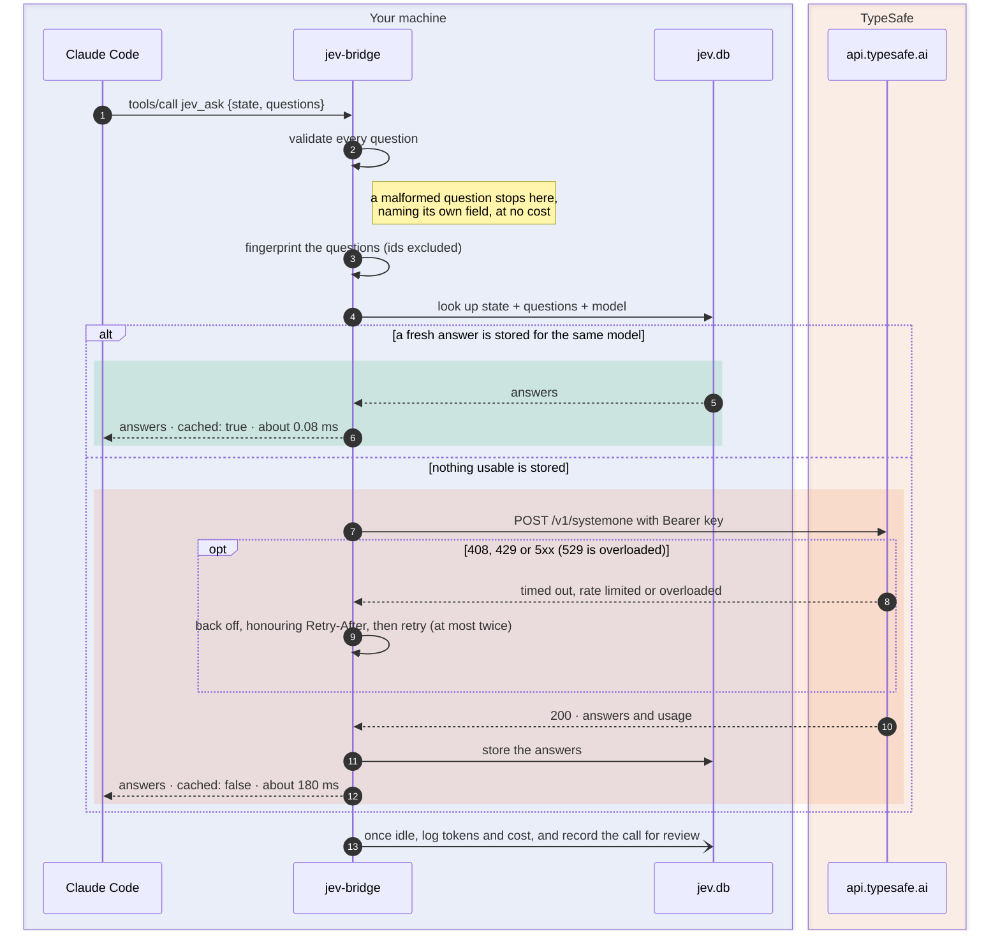
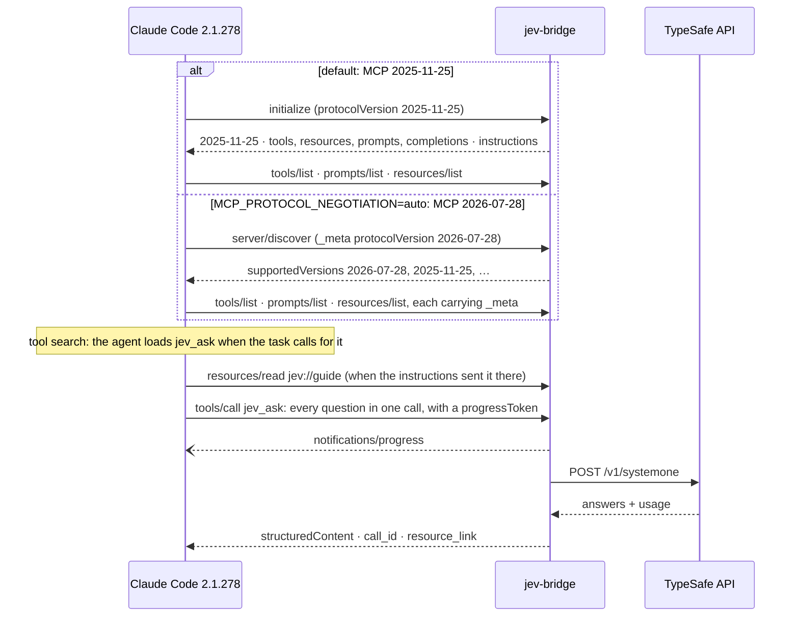

# jev-bridge

**Let Claude Code ask TypeSafe's Jev a question, and get a probability back.**

A zero-dependency [MCP](https://modelcontextprotocol.io) server for
[TypeSafe](https://typesafe.ai)'s System One model, Jev. It gives Claude Code — or
any MCP client — calibrated, typed judgments: yes/no probabilities, one-of-N
choices and graded scores, instead of generated prose. Repeated questions are
answered from a local cache for free, and every call's cost is recorded.

It follows the official specs, not a guess at them: MCP **2026-07-28** *and*
2025-11-25 (a dual-era server), Claude Code's own limits on what a server may
declare, and the TypeSafe API and SDK contract. It is shown working in **real
Claude Code sessions**, recorded message by message and checked against the
official MCP JSON Schema. Its install guide and every example in its
documentation are run as written, with the output kept. See
[Proven with Claude Code](#proven-with-claude-code) and
[Alignment with the official docs](#alignment-with-the-official-docs).

[](https://github.com/lhviet/jev-bridge/actions/workflows/ci.yml)
[](LICENSE)


```text
state:  "Help! My payouts have been failing for 3 days."
ask:    Which team should handle this?

        billing    ████████████████████  0.87
        technical  ███                   0.13
        sales      ·                     0.00      confidence 0.80 · $0.0000168
```

> jev-bridge is an independent project. It is not affiliated with or endorsed by
> TypeSafe AI.

## Quick start

You need Node.js 18 or newer (22.5+ keeps the cache between sessions),
[Claude Code](https://claude.com/claude-code) and a
[TypeSafe API key](https://console.typesafe.ai/keys). There is nothing to
`npm install`.

```bash
git clone https://github.com/lhviet/jev-bridge.git && cd jev-bridge
mkdir -p ~/.jev-bridge && chmod 700 ~/.jev-bridge
printf 'TYPESAFE_API_KEY=%s\n' 'your-key-here' > ~/.jev-bridge/.env && chmod 600 ~/.jev-bridge/.env
claude mcp add --scope user jev -- node "$(pwd)/src/server.mjs"
node src/server.mjs --selftest   # one live call: proves the key works
```

Then start a **new** Claude Code session and ask for a judgment in plain
language — *"Is this support message urgent, and which team should handle
it?"* Each step is explained under [Install](#install). This block and the full
guide were run as written, by a new user with an empty home directory, with
every output kept: **[evidence/install.md](evidence/install.md)**.

---

## Contents

- [Quick start](#quick-start)
- [Why this exists](#why-this-exists)
- [How it works](#how-it-works)
- [Proven with Claude Code](#proven-with-claude-code)
- [Use cases](#use-cases)
- [Prerequisites](#prerequisites)
- [Install](#install)
- [Configure your API key](#configure-your-api-key)
- [Connect it to Claude Code](#connect-it-to-claude-code)
- [Other MCP clients](#other-mcp-clients)
- [Check it works](#check-it-works)
- [Using it](#using-it)
- [Tools](#tools)
- [Resources, prompts and completions](#resources-prompts-and-completions)
- [Caching](#caching)
- [Cost and usage](#cost-and-usage)
- [Call history](#call-history)
- [Configuration](#configuration)
- [Where your data lives](#where-your-data-lives)
- [Alignment with the official docs](#alignment-with-the-official-docs)
- [Troubleshooting](#troubleshooting)
- [Development](#development)
- [References](#references)
- [Related projects](#related-projects)
- [Licence](#licence)

## Why this exists

TypeSafe publishes a Claude Code plugin, `typesafe@typesafe-ai`. It is a
*skill*: six files, 14 KB, and not one byte of executable code. It teaches an
agent how to write a good Jev question — but it has no way to send one. A skill
is text loaded into the model's context; it cannot hold an API key or open a
socket.

```text
typesafe@typesafe-ai 0.5.7
├── .claude-plugin/
│   ├── marketplace.json      382 B
│   └── plugin.json           320 B
├── skills/typesafe-ai/
│   ├── LICENSE              1068 B   identical to the LICENSE below
│   └── SKILL.md            10040 B   the whole product: guidance for the agent
├── LICENSE                  1068 B
└── README.md                1336 B

6 files · 14,214 bytes · 0 bytes executable
```

jev-bridge is the missing wire. It runs as a small child process that Claude
Code talks to over stdin and stdout, and it is the only thing that reaches the
TypeSafe API. It works well **alongside** the plugin: the skill teaches the
agent to design questions, and jev-bridge lets it ask them.

**Features**

- **Five tools** — `jev_ask`, `jev_usage`, `jev_history`, `jev_review`,
  `jev_models`, each with an `outputSchema`, `structuredContent` and the four
  behaviour hints (read-only, destructive, idempotent, open-world).
- **Both TypeSafe endpoints** — `POST /v1/systemone` and `GET /v1/models`, with
  the official SDKs' retry policy, timeout and environment variable names.
- **Resources, prompts and completions** — a question-design guide, live usage
  and history as resources; three prompts that Claude Code turns into slash
  commands; argument completion.
- **Both MCP eras** — the stateless 2026-07-28 protocol (`server/discover`,
  per-request `_meta`, cache hints, `subscriptions/listen`) and the
  `initialize` handshake of 2025-11-25 and earlier, chosen per request.
- **Cancellation and progress** — a cancelled call stops its HTTP request; a
  call that asks for progress hears about each retry.
- **An answer cache** — a repeated question returns in about 0.08 ms instead of
  about 180 ms, and costs nothing.
- **Cost accounting** — tokens, cost, latency and outcome for every call.
- **A call history you can review** — what was asked, what came back, how long
  it took and whether it was right, in a local dashboard (`--ui`). Written after
  each answer has gone back, so it costs the answer nothing.
- **Zero dependencies** — Node built-ins only, SQLite included.
- **Degrades instead of failing** — on a Node without SQLite it caches in memory.

## How it works

jev-bridge is a **child process, not a service**. Your MCP client starts it and
talks to it over stdin and stdout; it opens no port and exits with the session.
(The history dashboard is a separate command you start yourself, and it listens
only on 127.0.0.1.)
The only thing that leaves your machine is a cache miss.


Three trust zones. The key is read on your machine and attached only to a
request bound for TypeSafe — it never travels to Anthropic, and it is never
written into a config file. A repeated question never leaves your machine at all.

### One request, start to finish



Three things happen before any network call: every question is checked, the
questions are fingerprinted by their meaning rather than their ids, and the
cache is consulted. Only a successful answer is ever stored, so a transient
failure can never be served back to you as a cached one. The usage log and the
call history are written last — after the answer has gone back, once the
bridge is idle — so keeping them costs the call nothing.

### Reading the diagrams

Every diagram in this repository uses the same vocabulary. **Shape** says what a
thing is; **colour** says whose it is.

| Colour | Shape | Means |
| --- | --- | --- |
| 🟦 blue | rectangle | jev-bridge — code that runs on your machine |
| 🟪 violet | rounded box | an MCP client, or Claude |
| 🟩 green | cylinder | stored data — the answer cache, usage log and call history |
| 🟥 red | cylinder | your API key |
| 🟧 orange | pill · hexagon | TypeSafe's API · Jev making a judgment |
| 🟨 yellow | parallelogram | input you supply |
| ⬜ grey | rectangle | your own code |

Lines are coloured by what they carry: **green** is a cache hit, **orange** is a
trip to TypeSafe, **red** is the key being read. A dashed outline marks a trust
zone — a boundary your data crosses.

**Going deeper:** components, the storage decision, the database schema, how
cache keys work and how it is tested are in
**[docs/architecture.md](docs/architecture.md)**.

## Proven with Claude Code

Claude Code 2.1.278 was run headless against jev-bridge seven times, with only
this server configured and [a wire tap](evidence/tap.mjs) logging every
JSON-RPC message in between. The prompts ask for an outcome and never name a
tool. Everything below is read from those logs. The full report, with every
request the agent wrote and every answer, is
**[evidence/README.md](evidence/README.md)**.

- **24 of 24 checks passed** across the 7 sessions: Claude Sonnet 5 and Claude
  Haiku 4.5, over both MCP 2025-11-25 and 2026-07-28, using all five tools, a
  resource and a prompt.
- **Every message validates against the official MCP JSON Schema**: 49 from the
  server and 48 from Claude Code in those sessions, plus 53 server messages in
  a sweep of every method, error paths included. All 10 tool schemas pass the
  JSON Schema 2020-12 meta-schema that Claude Code checks them against.
- **Claude Code identified itself as `claude-code` on every connection**, and
  the server's own history filed each call under that name.



| Session | Protocol | What the agent did |
| --- | --- | --- |
| Four labels that can all be true, plus urgency; **every skill disabled**, so nothing but the server's own text told it about Jev | 2025-11-25 | Read `jev://guide`, then asked all 5 judgments in **one** `jev_ask`: a noul per label, a score for urgency |
| Rerank four search results | 2026-07-28 | One `jev_ask` scoring every passage |
| Route a ticket, record the known truth, audit the spend | 2026-07-28 | `jev_ask` → `jev_review` with **that call's `call_id`** and `expected` → `jev_usage` → `jev_history` |
| `/mcp__jev__cost_report 1` | 2025-11-25 | `prompts/get`, then the two tools the prompt prescribes |
| "Read `@jev:jev://guide`, then have Jev find the delivery date" | 2025-11-25 | `resources/read`, then a `choice` over the candidate dates with a `none` option, as the guide says |
| The same on Haiku, without asking for Jev | 2025-11-25 | Read the guide, then called `jev_ask` itself |
| "Is my key working?" on Haiku | 2026-07-28 | `jev_models` |

**How reliably.** One recording shows something can happen, not how often it
does, so three scenarios were recorded again, graded by the same checks.
Batching every question into one call held in 3 of 3 runs for the multi-label
and 3 of 3 for the rerank prompt. Haiku with the loose prompt called `jev_ask`
in **5 of 6** runs. In the other it read the guide and answered by itself.
That run is kept in the report, not dropped.

**What the recordings changed.** The first recordings exposed three weaknesses
in what the server told the agent, and each was fixed in the text rather than
in the prompts:

| Seen in an early recording | Why | Changed | Since |
| --- | --- | --- | --- |
| The rerank took two `jev_ask` calls: nouls first, then scores for the losers ([log](evidence/before/rerank-two-calls.wire.jsonl)) | Nothing said how to rank | "To rank candidates, give each its own score against the query in the same call" | One call, in every recording |
| Haiku loaded `jev_models`, then tried `curl` against the API | The description quoted `GET /v1/models` | Raw endpoints removed from what the model reads; the instructions say the bridge holds the key | No more `curl`. The kept recording calls `jev_models` straight away; one run between still tried a shell command first |
| Haiku read the guide and answered by itself | The guide read as reference, not as a step | The guide opens: design the questions here, then send them with `jev_ask` | 5 of 6 runs call `jev_ask` |

And before any of this, jev-bridge 0.1.0 answered Claude Code's 2026-07-28
probe with `-32601 Method not found` ([log](evidence/before/v0.1.0-discover-probe.wire.jsonl)).

**The install guide and the examples, run as written.** Two more records sit
beside the sessions, each generated by a script that reads the commands and
requests out of the documentation itself:

- **[evidence/install.md](evidence/install.md)** — every step of
  [Install](#install) through [Using it](#using-it), and the
  [Quick start](#quick-start), run by a new user with an empty home directory:
  clone, tests, key file, `claude mcp add`, `--selftest`, `claude mcp list`, a
  real Claude Code session with the "Using it" prompt, and the JSON other
  clients use.
- **[evidence/examples.md](evidence/examples.md)** — every `jev_ask` request in
  this README and in [docs/recipes.md](docs/recipes.md), sent live, each
  checked against the decision its text describes. Raw responses:
  [examples.json](evidence/examples.json).

**Reproduce it:**

```bash
node evidence/run.mjs                           # record the sessions: needs claude and a TypeSafe key
node evidence/run.mjs --trials 3 modern-rerank  # repeat one, to measure reliability
node evidence/validate-wire.mjs                 # installs Ajv into the temp directory, outside the project
node evidence/report.mjs                        # rewrite evidence/README.md
node evidence/install.mjs                       # follow the install guide in a sandbox: rewrites evidence/install.md
node evidence/examples.mjs                      # run every documented request: rewrites evidence/examples.md
```

## Use cases

Six patterns, each shown with the **real** output it produced from
`jev-1.13.0`. All six together ran in 1.3 seconds and cost $0.000162. Each links
to its full request in [docs/recipes.md](docs/recipes.md). The latest live run
of all six, checked against what each section says, is in
[evidence/examples.md](evidence/examples.md).

### Route a request and fill its arguments in one trip

Choose the handler **and** the arguments every branch would need, in parallel. Your code takes one branch and reads only its answers.

> "Can you refund my last order? The mug arrived cracked and I have photos."

```text
handler        choice  ████████████████████  issue_refund  confidence 1.00
refund_reason  choice  ████████████████████  damaged       confidence 1.00
has_evidence   noul    ███████████████████▊  0.99
needs_human    noul    ████                  0.20
```

A router and its arguments in one round trip: 233 ms, $0.000022. [Full request →](docs/recipes.md#1-route-a-request-and-fill-its-arguments-in-one-trip)

### Rerank what your search returned

Retrieval returns candidates but cannot tell which one answers the question. Give each its own comparable `score` against the query, then sort in code.

> "How do I rotate the API key without downtime?"

```text
How well does each passage answer the query?   (score, 0–3)

b  ███████████████████▉  2.99  ← answers the query
c  ███████▏              1.06  ← on topic, but never answers it
d  ▋                     0.10
a  ▍                     0.06
```

Passage **c** is *about* API keys and never answers the question. A keyword search would have ranked it first. [Full request →](docs/recipes.md#2-rerank-what-your-search-returned)

### Check a claim against its evidence

The guard in front of anything a language model asserts. Ask about support and contradiction **separately** — they are different failures.

> claim: "The free plan includes 10 GB of storage."  
source: "Free accounts may store up to 2 GB…"

```text
supported     noul  ▎                     0.01
contradicted  noul  ███████████████████   0.95  ← the source says otherwise
```

Not merely unsupported: contradicted. That is the case to escalate rather than quietly drop. [Full request →](docs/recipes.md#3-check-a-claim-against-its-evidence)

### Apply labels that can all be true at once

Reach for one `noul` per label, not a `choice` — a choice forces a single winner and would throw three true facts away.

> "Third time this week the export button does nothing. I am on the Pro plan paying $40/mo and I want a refund if this is not fixed today."

```text
reports_bug       noul  ███████████████████▍  0.97
mentions_billing  noul  ███████████████████▊  0.99
requests_refund   noul  ███████████████████▍  0.97
churn_risk        noul  █████████████████▋    0.88  ← inferred rather than stated
```

All four are true, in one sentence. [Full request →](docs/recipes.md#4-apply-labels-that-can-all-be-true-at-once)

### Let code find candidates, and Jev pick the right one

Do not ask a model to *extract* a date — ask it to *choose* one. A regular expression finds every candidate; only the choice needs judgment, and the value you copy is guaranteed to be in the text.

> "Ordered 3 Jan, dispatched 5 Jan, and it should reach you by 11 Jan. Returns close 25 Jan."

```text
Which candidate is the expected DELIVERY date?   (choice)

11 Jan  ████████████████████  1.00  the delivery date
3 Jan   ·                     0.00  ordered
5 Jan   ·                     0.00  dispatched
25 Jan  ·                     0.00  returns close
none    ·                     0.00
```

The three decoy dates land at zero. Always offer a `none`, or a list that misses the answer forces a confident wrong pick. [Full request →](docs/recipes.md#5-let-code-find-candidates-and-jev-pick-the-right-one)

### Score dimensions once, decide the policy in code

Keep judgment and policy apart. Jev rates each dimension; your code weights them — so changing a weight costs nothing and needs no new call.

> A pull request description, in full: "Fixes the thing. See ticket."

```text
clarity      score 0–3  ▍                     0.05  confidence 0.95
testability  score 0–2  ██                    0.20  confidence 0.69  ← least certain answer here
```

In code, `0.6 × clarity/3 + 0.4 × testability/2 = 0.05`. The 0.69 confidence is the model saying there is little to judge. [Full request →](docs/recipes.md#6-score-dimensions-once-decide-the-policy-in-code)

## Prerequisites

You need three things.

### 1. Node.js 18 or newer — 22.5+ recommended

```bash
node --version
```

jev-bridge runs on any Node from 18. The **persistent** cache uses
[`node:sqlite`](https://nodejs.org/api/sqlite.html), which arrived in Node 22.5;
on older versions everything still works, but the cache lasts only as long as
the session. The current LTS is the simplest choice.

If you need to install or upgrade Node:

```bash
# with nvm (https://github.com/nvm-sh/nvm)
nvm install --lts

# or with Homebrew on macOS
brew install node
```

Or download it from [nodejs.org](https://nodejs.org).

### 2. A TypeSafe API key

Create one in the [TypeSafe console](https://console.typesafe.ai/keys). You can
try Jev without any code in the
[Playground](https://console.typesafe.ai/playground) first.

### 3. An MCP client

These instructions use [Claude Code](https://claude.com/claude-code). jev-bridge
is a standard stdio MCP server, so Claude Desktop, Cursor, and other MCP clients
work too — see [Other MCP clients](#other-mcp-clients).

## Install

```bash
git clone https://github.com/lhviet/jev-bridge.git
cd jev-bridge
```

That is the whole installation. There is **no `npm install` step**, because
there are no dependencies. Optionally, run the tests:

```bash
npm test
```

Note the absolute path of the server — you will need it in a moment:

```bash
echo "$(pwd)/src/server.mjs"
```

**Updating** is a pull, then a new Claude Code session:

```bash
git -C /path/to/jev-bridge pull
```

Your key and your data live in `~/.jev-bridge/`, not in the clone, so an update
never touches them. If you also work on jev-bridge, keep that clone separate
from the one Claude Code runs, and clone the installed copy *from* your working
copy. Then the installed copy only ever runs what you have committed, never a
half-finished edit, and a `git pull` brings it up to date without a push.

## Configure your API key

There are two ways. The first is recommended.

### Option A — a key file (recommended)

```bash
mkdir -p ~/.jev-bridge && chmod 700 ~/.jev-bridge
printf 'TYPESAFE_API_KEY=%s\n' 'your-key-here' > ~/.jev-bridge/.env
chmod 600 ~/.jev-bridge/.env
```

This keeps the secret **out of your MCP client's configuration file** — a file
people often sync between machines, paste into issues, or commit to dotfile
repositories. jev-bridge reads the key fresh on every call, so rotating it is a
one-file edit and needs no restart.

### Option B — an environment variable

Pass `TYPESAFE_API_KEY` through your client's configuration, shown in the next
section. Simpler, but the key then sits in that config file in plain text.

## Connect it to Claude Code

```bash
claude mcp add --scope user jev -- node /absolute/path/to/jev-bridge/src/server.mjs
```

- `--scope user` makes it available in **every** project. Use `--scope project`
  to share it with one repository through its `.mcp.json`, or omit `--scope`
  to add it to the current project only.
- If you chose Option B, add the key with `-e`:

  ```bash
  claude mcp add --scope user jev -e TYPESAFE_API_KEY=your-key-here \
    -- node /absolute/path/to/jev-bridge/src/server.mjs
  ```

> **Use nvm, or have several Node versions installed?** Give Claude Code the
> absolute path to the interpreter, not bare `node`. Otherwise the server runs
> on whichever Node is first on `PATH` when Claude Code starts — possibly an
> old one without SQLite.
>
> ```bash
> claude mcp add --scope user jev -- "$(which node)" /absolute/path/to/jev-bridge/src/server.mjs
> ```

**Which protocol Claude Code speaks.** By default Claude Code opens a stdio
server with the `initialize` handshake of MCP 2025-11-25, and jev-bridge
answers it. To have Claude Code use the stateless 2026-07-28 revision instead,
start it with:

```bash
MCP_SDK_GENERATION=v2 MCP_PROTOCOL_NEGOTIATION=auto claude
```

It then probes with `server/discover`, jev-bridge lists the versions it
supports, and every request after that carries its own `_meta`. Both are
recorded in [evidence/](evidence/README.md#the-two-protocol-revisions-as-recorded).

**How Claude finds the tools.** With tool search on (the default), a session
starts with only the tool names and the server's instructions. The instructions
tell Claude which tasks call for Jev, so it loads `jev_ask` when one comes up.
You do not have to name the tool.

## Other MCP clients

Any client that launches stdio servers can use the same command. The usual JSON
shape — for Claude Desktop's `claude_desktop_config.json`, Cursor's
`.cursor/mcp.json`, and similar:

```json
{
  "mcpServers": {
    "jev": {
      "command": "node",
      "args": ["/absolute/path/to/jev-bridge/src/server.mjs"]
    }
  }
}
```

With Option B, add `"env": { "TYPESAFE_API_KEY": "your-key-here" }` beside
`args`.

## Check it works

**1. Call the API directly.** This bypasses the cache and proves the key is good:

```bash
node src/server.mjs --selftest
```

You should see `key: loaded (…)` followed by a JSON answer from `jev-1.13.0`.

**2. Check Claude Code can reach the server:**

```bash
claude mcp list
```

```text
jev: node /…/jev-bridge/src/server.mjs - ✔ Connected
```

**3. Start a new Claude Code session.** A session that was already running
when you added the server fixed its tool list at startup and will not see it.

What each of these printed on a new user's machine, from the clone to the
first answer in Claude Code, is in [evidence/install.md](evidence/install.md).

## Using it

Ask for it in plain language. Claude Code writes the request:

```text
Use jev_ask to decide whether this support message is urgent and which team
should handle it: "Help! My payouts have been failing for 3 days."
```

### The three question types

| Type | Ask it when | You get back |
| --- | --- | --- |
| `noul` | A condition either holds or it doesn't | One probability from 0 to 1. **0.5 means genuinely torn**, not "medium". |
| `choice` | Exactly one option from a set you define | The winner, the full distribution, and a confidence. |
| `score` | A degree along a rubric you describe | A weighted position that can land *between* your levels, plus the distribution. |

### A complete request

```json
{
  "state": "Help! My payouts have been failing for 3 days.",
  "questions": {
    "is_urgent":   { "type": "noul",   "instructions": "Does this convey urgency?" },
    "department":  { "type": "choice", "instructions": "Which team should handle this?",
                     "criteria": { "billing": "Payments, invoicing, refunds",
                                   "technical": "Bugs, outages, integrations",
                                   "sales": "Pricing, upgrades" } },
    "frustration": { "type": "score",  "instructions": "How frustrated is the customer?",
                     "criteria": ["Calm", "Frustrated", "Very angry"] }
  }
}
```

```json
{
  "model": "jev-1.13.0",
  "answers": {
    "is_urgent":   { "type": "noul", "noul": 0.95 },
    "department":  { "type": "choice", "choice": "billing", "confidence": 0.8,
                     "probabilities": { "billing": 0.87, "technical": 0.13, "sales": 0 } },
    "frustration": { "type": "score", "score": 1.05, "confidence": 0.92,
                     "legend": { "0": "Calm", "1": "Frustrated", "2": "Very angry" },
                     "probabilities": { "0": 0, "1": 0.95, "2": 0.05 } }
  },
  "usage": { "input_tokens": 399, "output_tokens": 73 },
  "bridge": { "cached": false, "latency_ms": 184, "cost_usd": 0.0000168 }
}
```

### Getting good answers

- **Batch independent questions into one call.** Jev reads the state once and
  answers every question in parallel — cheaper and faster than separate calls.
- **Use one `noul` per label** when several can be true at once. A `choice`
  forces a single winner and discards the rest.
- **Include a no-match option** in a `choice` when nothing may fit, or the model
  is forced to pick a wrong answer confidently.
- **Question ids are not sent to the model.** Put the full meaning in
  `instructions`.
- **Keep policy in your code.** Take the probabilities and apply your own
  thresholds; changing a threshold then costs nothing.

See [Use cases](#use-cases) for six patterns with real output, and
[docs/recipes.md](docs/recipes.md) for each full request.

## Tools

Every tool declares a `title`, an `outputSchema`, and the four behaviour hints
the MCP spec defines. A client may use the hints to decide what to confirm with
you; they are hints, not guarantees.

| Tool | Read-only | Destructive | Idempotent | Open world | Reaches |
| --- | --- | --- | --- | --- | --- |
| `jev_ask` | yes | no | yes | **yes** | `POST /v1/systemone` (billed), unless cached |
| `jev_usage` | yes | no | yes | no | the local database |
| `jev_history` | yes | no | yes | no | the local database |
| `jev_review` | **no** | no | yes | no | the local database: writes a review |
| `jev_models` | yes | no | yes | **yes** | `GET /v1/models` |

`jev_ask` counts as read-only because it changes nothing you own; it is
open-world because it calls TypeSafe. Every result carries `structuredContent`
and the same JSON as text. A bad argument comes back as a tool error that names
the field (`questions["q"] has an unknown field "options"…`), so the model can
fix it and retry. An unknown tool is a JSON-RPC error, `-32602`.

### `jev_ask`

Evaluate a `state` against typed questions. The input schema spells out each
question type — `noul`, `choice`, `score` — with its own `criteria` shape, so
the model sees the exact contract before it writes a request.

| Input | Required | Description |
| --- | --- | --- |
| `state` | yes | Text, or a JSON object or array. Text only — no images or binaries. |
| `questions` | yes | A map of your own ids to `{ type, instructions, criteria }`. |
| `model` | no | Model or alias. Defaults to `jev-latest`. |
| `cache` | no | `false` forces a live call and refreshes the stored answer. |

Returns `model`, `answers`, `usage`, and a `bridge` object: `cached`,
`latency_ms`, `cost_usd` — what **this** call cost, which is `0` on a hit —
`call_id`, which names the call in the history, `attempts`, and TypeSafe's
`request_id`. On a cache hit, `usage` describes the original call. Clients on
2025-06-18 or later also get a `resource_link` to `jev://history/<call_id>`.

Before anything is sent, every question is checked against the API reference:
a known type, instructions present, no unknown fields, a noul's criteria keyed
only by `true`/`false`, 2–255 choice options, 2–10 score levels in an array.

### `jev_usage`

Calls, cache hits, hit rate, tokens, cost, money saved by the cache, and a
per-day breakdown. Input: `days` (default 7).

### `jev_history`

Looks back at earlier calls. With no `id`, it returns stats for the period and
the matching calls, each with the start of its state and its answers on one
line. With `id`, it returns that call in full: state, questions, answers,
timing, cost and review. Read-only.

| Input | Default | Description |
| --- | --- | --- |
| `id` | — | A `bridge.call_id`. Returns that one call in full. |
| `days` | `7` | How far back to look. |
| `filter` | `all` | `all`, `live`, `cached`, `errors`, `uncertain`, `slow`, `unreviewed`, `reviewed`, `correct`, `partial`, `incorrect`. |
| `below` | `0.6` | The certainty cut for `uncertain`. |
| `q` | — | Only calls whose state or answers contain this text. |
| `limit` | `20` | Most calls to list. |

### `jev_review`

Records whether a past call was right: `verdict` is `correct`, `partial` or
`incorrect` (or `null` to withdraw a review). Optional `expected` records what
the answers should have been, by question id, and `note` says why. Claude can
call it itself when you correct an answer, or you can review in the
[dashboard](#call-history).

### `jev_models`

The model names and aliases your account may use (`GET /v1/models`, shaped as
`{ models: [{ name, description, release_date }] }`). Also the cheapest way to
check a key.

## Resources, prompts and completions

**Resources** are context a client can attach. In Claude Code, type `@` and
pick one, or write `@jev:jev://guide`; Claude can also read them itself.

| URI | What | Cache hint (2026-07-28) |
| --- | --- | --- |
| `jev://guide` | How to design Jev questions, condensed from TypeSafe's docs, with links | public, 1 day |
| `jev://models` | The models this key may use, fetched live | private, 1 hour |
| `jev://usage` | Usage over the last 7 days, as `jev_usage` returns it | private, 0 |
| `jev://history` | The last 20 calls and their stats, as `jev_history` returns them | private, 0 |
| `jev://history/{id}` | One call in full (a resource template) | private, 0 |

`jev://usage`, `jev://history` and `jev://history/{id}` can be subscribed to:
`resources/subscribe` in 2025-11-25, `subscriptions/listen` in 2026-07-28. The
server says when each changes.

**Prompts** are workflows you start. Claude Code lists each as a slash command,
`/mcp__<server>__<prompt>`, with arguments separated by spaces:

| Prompt | Arguments | Does |
| --- | --- | --- |
| `review_uncertain` | `days`, `below` | Walks the calls Jev was least sure of, judges each, records verdicts with `jev_review` |
| `cost_report` | `days` | Spend, hit rate, latency and the calls that should have been batched |
| `question_design` | — | Loads the guide and drafts the `jev_ask` request for the task in hand |

```text
/mcp__jev__cost_report 30
/mcp__jev__review_uncertain 7 0.7
```

**Completions** suggest values for prompt arguments (`days`, `below`) and for
the `{id}` of `jev://history/{id}` (recent call ids).

## Caching

A repeated question is answered from `~/.jev-bridge/jev.db` without touching
the network.

| | Live call | Cached |
| --- | --- | --- |
| Latency | 184 ms (average of 3) | **0.077 ms** (median of 20) |
| Cost | about $0.000017 | **$0** |
| Leaves your machine | yes | no |

That is roughly **2,370× faster** on a repeat.

- **What makes two requests "the same":** the state, the model, and the
  *meaning* of each question. **Question ids are deliberately ignored.**
  TypeSafe never sends them to the model, and an agent invents a fresh id every
  run — so `{"urgency": q}` and `{"urgency_check": q}` share one cache entry,
  and the answer comes back under whichever id you used.
- **Object key order does not matter; array order does.** The levels of a
  `score` are ordered, and reversing them is a different question.
- **Entries expire after 7 days** and the least-recently-used are evicted past
  20,000 entries.
- **A moved alias invalidates itself.** Each entry records which model answered
  it. When `jev-latest` starts resolving to a newer version, older entries stop
  being served.
- **Failures are never cached.** Only a successful answer is stored.

Why ids are excluded — and how a real Claude Code session exposed the cache
missing almost every time before they were — is told in
[docs/architecture.md](docs/architecture.md#cache-keys).

**A note on determinism.** Jev's *decisions* are stable across repeated calls,
but its probabilities vary slightly — about ±0.02 in the second decimal. A
cached answer freezes one sample of that. Pass `"cache": false` when you are
measuring rather than deciding.

**Expect hits within a session, and from code that sends a fixed question.**
Across separate agent sessions the model tends to rephrase, and a genuinely
different question is correctly a miss.

## Cost and usage

Jev bills input tokens only; output is free. At the published price of $0.042
per million input tokens, a typical 400-token call costs about **$0.000017** —
roughly 60,000 calls to the dollar.

Ask Claude Code to run `jev_usage`, or use the command line:

```bash
node src/server.mjs --stats 7
```

```json
{
  "calls": 24, "live_calls": 3, "cache_hits": 21, "hit_rate": 0.875,
  "input_tokens": 1197, "cost_usd": 0.00005027,
  "saved_input_tokens": 8379, "saved_usd": 0.00035192
}
```

## Call history

Every `jev_ask` — answered live, from the cache, rejected, or timed out — is
kept for review, so you can come back later and ask two questions of it:
**was it efficient**, and **was it right**.

```bash
node src/server.mjs --ui
```

That opens a dashboard in your browser. It shows:

- **Speed and cost:** typical and 95th-percentile latency of live calls, the
  cache hit rate, what was spent, and a dot per live call over time. Failed
  calls and calls that were retried after a rate limit stand out.
- **Batching:** *re-sent states* counts live calls that sent a state already
  sent earlier. Their questions could have gone in the earlier call, which
  would have been cheaper and faster.
- **Certainty:** each call is scored by its **least** sure answer — a `choice`
  or `score` by Jev's own confidence, a `noul` by its distance from 0.5 (so
  0.5 is 0, and 0.95 is 0.9). The *Least certain* filter lists the calls most
  worth a second look first.
- **Accuracy:** open a call to see the state, every question, and each answer
  as bars. Mark it *Correct*, *Partly right* or *Wrong*, click the option that
  should have won, and add a note. Accuracy is the share of reviewed calls
  marked correct.

The same history is available to Claude through `jev_history` and
`jev_review`, and on the command line:

```bash
node src/server.mjs --history 7 uncertain   # stats and calls as JSON
node src/server.mjs --clear-history         # forget it all; the cache and usage log stay
```

**Going further.** The database is an ordinary SQLite file, and
[docs/analytics.md](docs/analytics.md) shows how to query it safely: latency
by model, failures and retries, calls that should have been batched, whether
Jev's certainty predicts its accuracy, accuracy per question, and exports to
CSV, JSON or Python. It also turns your reviewed calls into an evaluation set
and replays it against a new model, so you can see whether `jev-preview` is
better on *your* questions before you switch:

```bash
node examples/eval-set.mjs > eval.jsonl
node examples/replay.mjs eval.jsonl jev-preview
```

**What is kept.** `TYPESAFE_HISTORY` decides:

| Mode | Keeps | Use it when |
| --- | --- | --- |
| `full` (default) | the state and questions, the answers, timing, tokens, cost | you want to judge whether answers were right |
| `meta` | answers, timing, tokens, cost, and hashes of the state and questions — **not** the state or question text | the state is sensitive, and speed and cost are what you need |
| `off` | nothing | you want no history |

Each state is stored once however often it is sent. Calls older than 30 days
are pruned, and no more than 10,000 are kept — except **reviewed calls, which
are never pruned**: they have become labelled examples.

**It does not slow calls down.** Nothing is written while a call is being
answered: records queue in memory and are written in one transaction once the
bridge has been idle for 20 ms (at most 500 ms later, or after 100 calls).
Measured end to end over MCP, against the version without history, with an
instant fake API so that only the bridge's own time shows:

| | Before | With `full` history |
| --- | --- | --- |
| Cache hit, median | 114–119 µs | 108–116 µs |
| Cache hit, 95th percentile | 0.17–0.25 ms | 0.21–0.31 ms |
| Live call, median | 450–533 µs | 437–484 µs |
| Live call, 95th percentile | 0.8–2.0 ms | 0.9–1.1 ms |

Medians are unchanged — slightly faster, since the usage log moved off the
answer's path too — and the 95th percentiles move by a tenth of a millisecond
at most. The one cost shows only in an unbroken burst of thousands of
back-to-back calls: the call that lands on a 100-call write waits for it, which
adds 2–4 ms at the 99th percentile. Against the real API the write happens
while the next call is waiting for the network, and between Claude's turns
nobody is waiting at all.

## Configuration

Everything is optional.

| Variable | Default | Purpose |
| --- | --- | --- |
| `TYPESAFE_API_KEY` | — | The API key, if not using a key file. |
| `TYPESAFE_API_KEY_FILE` | — | Read the key from this file instead. |
| `JEV_BRIDGE_HOME` | `~/.jev-bridge` | Where the key file and database live. |
| `TYPESAFE_DB` | `$JEV_BRIDGE_HOME/jev.db` | The database path. |
| `TYPESAFE_DEFAULT_MODEL` | `jev-latest` | Default model, the SDKs' name for it. Pin a version such as `jev-1.13.0` if you tune thresholds against it. `TYPESAFE_MODEL` also works. |
| `TYPESAFE_CACHE_TTL_DAYS` | `7` | How long an answer stays fresh. |
| `TYPESAFE_CACHE_MAX` | `20000` | Cache entries kept before eviction. |
| `TYPESAFE_HISTORY` | `full` | `full`, `meta` or `off`: how much of each call to keep for review. See [Call history](#call-history). |
| `TYPESAFE_HISTORY_DAYS` | `30` | How long an unreviewed call is kept. |
| `TYPESAFE_HISTORY_MAX` | `10000` | Unreviewed calls kept before the oldest go. |
| `TYPESAFE_USD_PER_MTOK` | `0.042` | Price used to compute cost. |
| `TYPESAFE_TIMEOUT_MS` | `10000` | Timeout per attempt, as in the SDKs. There is no total budget. |
| `TYPESAFE_MAX_RETRIES` | `2` | Retries after the first attempt, for 408, 429, 5xx, timeouts and dropped connections. `0` turns retrying off. |
| `TYPESAFE_BACKOFF_INITIAL_MS` | `500` | First backoff, doubling to 5 s with 25 % jitter. A `Retry-After` or `retry-after-ms` up to 60 s is used instead. |
| `TYPESAFE_BASE_URL` | `https://api.typesafe.ai` | API root, the SDKs' name for it; `/v1` is added. Must be `https://`, or `http://` to this machine, or the key is not sent. |
| `TYPESAFE_API_URL` | — | Full API base including `/v1`. Wins over `TYPESAFE_BASE_URL` when both are set. |

The key is looked up in this order: `TYPESAFE_API_KEY`,
`TYPESAFE_API_KEY_FILE`, `~/.jev-bridge/.env`, then a `.env` at the repository
root.

## Where your data lives

| Path | Contents |
| --- | --- |
| `~/.jev-bridge/` | Created with mode `0700`. |
| `~/.jev-bridge/.env` | Your API key, if you used Option A. |
| `~/.jev-bridge/jev.db` | Cached answers, the usage log and the call history. Mode `0600`, as are its journal files. |

The **cache** stores answers, keyed by hashes of the request, and the **usage
log** stores token counts, costs and timings. Neither holds your `state` or
your question text. The **call history** does, when `TYPESAFE_HISTORY` is
`full` — the default — because judging whether an answer was right needs what
was asked. Set it to `meta` to keep only answers, timings and hashes, or `off`
to keep nothing. Answers repeat your option names and score level labels, in
every mode. The database is never uploaded, but `jev_history` does hand stored
states back to your MCP client, and one database serves every project. Your
key is sent only to the TypeSafe API, only over HTTPS, and is never logged. See
[SECURITY.md](SECURITY.md).

## Alignment with the official docs

Each row names the rule, where it is written down, what jev-bridge does about
it, and what checks it. "Test" means `npm test`; "recorded" means a real Claude
Code session in [evidence/](evidence/README.md); "schema" means
[`validate-wire.mjs`](evidence/validate-wire.mjs), which runs every message
through the official MCP JSON Schema.

### MCP, revisions 2026-07-28 and 2025-11-25

| Rule | jev-bridge | Checked by |
| --- | --- | --- |
| A server may serve both eras, choosing per request ([versioning](https://modelcontextprotocol.io/specification/2026-07-28/basic/versioning#backward-compatibility-with-initialization-based-versions)) | A request whose `_meta` names a version is served statelessly; `initialize` starts a 2025-11-25-or-earlier session | test, recorded both ways |
| Servers **MUST** implement `server/discover` ([discovery](https://modelcontextprotocol.io/specification/2026-07-28/server/discover)) | Returns `supportedVersions`, capabilities, instructions, `serverInfo` in `_meta`, `ttlMs`, `cacheScope` | test, recorded, schema |
| An unsupported version is `-32022` with `supported` and `requested` ([versioning](https://modelcontextprotocol.io/specification/2026-07-28/basic/versioning#protocol-version-negotiation)) | Yes | test, schema |
| A request without `clientCapabilities` is malformed: `-32602` ([`_meta`](https://modelcontextprotocol.io/specification/2026-07-28/basic/index#meta)) | Yes | test, schema |
| Every result carries `resultType`; `serverInfo` in `_meta` ([base protocol](https://modelcontextprotocol.io/specification/2026-07-28/basic/index#resulttype)) | In 2026-07-28 results; left out of older ones | test, schema |
| List and read results carry `ttlMs` and `cacheScope` ([caching](https://modelcontextprotocol.io/specification/2026-07-28/server/utilities/caching)) | Lists: public, 1 hour. Reads: per resource | test, schema |
| `initialize` and `ping` are gone from 2026-07-28 ([changelog](https://modelcontextprotocol.io/specification/2026-07-28/changelog)) | `-32601` in that era; still served to older clients | test, schema |
| `initialize` answers with the requested version if supported, else one it supports ([lifecycle](https://modelcontextprotocol.io/specification/2025-11-25/basic/lifecycle#version-negotiation)) | Echoes 2024-11-05 through 2025-11-25; anything else gets 2025-11-25 | test |
| Tools: `title`, `annotations`, `outputSchema`; `structuredContent` that fits it, plus the same JSON as text; a fixed order ([tools](https://modelcontextprotocol.io/specification/2026-07-28/server/tools)) | All five tools | test (each result checked against its schema), schema |
| Unknown tool: protocol error `-32602`. Bad input or API failure: a result with `isError` ([tool errors](https://modelcontextprotocol.io/specification/2026-07-28/server/tools#error-handling)) | Yes | test |
| Resources, templates, and update notifications ([resources](https://modelcontextprotocol.io/specification/2026-07-28/server/resources), [subscriptions](https://modelcontextprotocol.io/specification/2026-07-28/basic/patterns/subscriptions)) | 4 resources, 1 template; `resources/subscribe` before 2026-07-28, `subscriptions/listen` after, acknowledged first and closed gracefully | test, schema |
| A missing resource is `-32602` in 2026-07-28, `-32002` before ([base protocol](https://modelcontextprotocol.io/specification/2026-07-28/basic/index#error-codes)) | Chosen by era | test |
| Prompts ([prompts](https://modelcontextprotocol.io/specification/2026-07-28/server/prompts)) and completion ([completion](https://modelcontextprotocol.io/specification/2026-07-28/server/utilities/completion)) | 3 prompts; completions for their arguments and for call ids | test, recorded, schema |
| Progress only for requests that sent a `progressToken`, always increasing, never after the response ([progress](https://modelcontextprotocol.io/specification/2026-07-28/basic/patterns/progress)) | On start and on each retry | test, recorded |
| Cancellation: stop work, send no response ([cancellation](https://modelcontextprotocol.io/specification/2026-07-28/basic/patterns/cancellation)) | Aborts the HTTP request and its backoff wait | test |
| stdio: only MCP messages on stdout; logs to stderr; exit when stdin closes ([stdio](https://modelcontextprotocol.io/specification/2026-07-28/basic/transports/stdio)) | Yes; in-flight answers are drained first | test |
| Logging, sampling and roots are deprecated ([deprecated features](https://modelcontextprotocol.io/specification/2026-07-28/deprecated)) | Not implemented, on purpose: diagnostics go to stderr | — |
| Elicitation through multi round-trip requests ([MRTR](https://modelcontextprotocol.io/specification/2026-07-28/basic/patterns/mrtr)), the tasks extension, icons | Not used: no call needs your input halfway (`jev_review` takes the verdict as arguments), a call finishes in about 200 ms, and icons are optional | — |

### Claude Code as the client

| Claude Code does this ([MCP docs](https://code.claude.com/docs/en/mcp)) | So jev-bridge |
| --- | --- |
| Defers MCP tools behind tool search; a session starts with tool names and server instructions only | Server instructions say which tasks call for Jev and what each tool is for |
| Cuts tool descriptions and server instructions at 2 KB | Keeps the longest, `jev_ask`, near 1.6 KB, with the rules first; a test enforces the limit |
| Drops a tool whose input schema is not valid JSON Schema 2020-12, or whose top-level property names break `[A-Za-z0-9_.-]{1,64}` | Every schema passes Ajv's 2020-12 meta-schema check; a test checks the names |
| Rewrites root-level `anyOf`/`oneOf` | Has none at the root; the three question shapes are a `oneOf` inside `questions` |
| Saves results over its output limit to a file | `jev_history` declares `anthropic/maxResultSizeChars` so a long report stays inline |
| Lists MCP prompts as `/mcp__<server>__<prompt>`, splitting arguments on spaces | Every prompt argument is a single token |
| Offers resources with `@` and reads them with `ReadMcpResourceTool` | The guide is a resource the instructions point to; recorded being read |
| Negotiates 2026-07-28 on its v2 runtime with `MCP_PROTOCOL_NEGOTIATION=auto` | Answers the `server/discover` probe; recorded |
| Sends a `progressToken` with every tool call | Reports the start of each live call on it (recorded) and every retry (tested) |

### The TypeSafe API and SDKs

| Official contract ([API](https://docs.typesafe.ai/api), [models](https://docs.typesafe.ai/models), SDK [retries](https://docs.typesafe.ai/sdk/python/api/retries), [RetryPolicy](https://docs.typesafe.ai/sdk/javascript/api/interfaces/RetryPolicy), [constants](https://docs.typesafe.ai/sdk/python/api/constants)) | jev-bridge |
| --- | --- |
| `POST /v1/systemone`: `state` a string, object or array; `questions` a map of `noul`, `choice` or `score` | `jev_ask`, with the shapes checked before sending |
| `instructions` and criteria entries: string, object or array; choice ≤ 255 options; score 2–10 levels | Same checks locally, naming the field that fails |
| `GET /v1/models` returns `{ models: [{ name, description, release_date }] }` | `jev_models` and `jev://models`, typed |
| Retry 408, 429 and 500–599, connection errors and timeouts; at most 2 retries; backoff 500 ms doubling to 5 s, 25 % jitter; honour `Retry-After` and `retry-after-ms` up to 60 s | The same defaults, tested one by one |
| Timeout 10 s per attempt, no total budget | The same |
| Environment: `TYPESAFE_API_KEY`, `TYPESAFE_BASE_URL`, `TYPESAFE_DEFAULT_MODEL` | Read, as well as the bridge's older names |
| Errors carry `x-typesafe-request-id` | Quoted in every error, and returned as `bridge.request_id` |
| 64k tokens per request; 32k for state plus the longest question; text only | Stated in the `jev_ask` description and the guide |
| Batch every question about one state in one call; ids are never sent to the model; include a none option; one noul per label ([primitives](https://docs.typesafe.ai/primitives), [fan-out](https://docs.typesafe.ai/patterns/fan-out)) | Stated first in the description; recorded agents batching |

## Troubleshooting

**`claude mcp list` shows the server as failed.** Run the command it shows by
hand — `node /path/to/src/server.mjs --version` — to see the real error. The
usual causes are a wrong path or a `node` that is not on Claude Code's `PATH`.
Use absolute paths for both.

**The tools do not appear in Claude Code.** Start a new session. A running
session fixed its tool list at startup.

**`TypeSafe API returned 401`.** The key is missing or rejected. Run
`--selftest`: it prints which key it loaded, by length and first eight
characters.

**`The TypeSafe API key in … has spaces, line breaks or other characters a key
cannot have`.** The file holds something besides the key — a stray word on the
key's line, or a second bare line. Leave just `TYPESAFE_API_KEY=<key>` in it,
or the key alone.

**The log says `node:sqlite unavailable`.** Your Node is older than 22.5.
Everything works, but the cache is in memory and resets each session. Upgrade
Node, or register the server with the absolute path of a newer one.

**`429`, `529` or other `5xx` errors.** jev-bridge already retries these —
and `408`, timeouts and dropped connections — twice, with backoff, as the
TypeSafe SDKs do. If they persist, you are over your rate limit or TypeSafe is
under load. The error names TypeSafe's request id; quote it to their support.

**The dashboard is empty.** It reads the same database as the MCP server, so
check both see the same `TYPESAFE_DB` and `JEV_BRIDGE_HOME`, and that the MCP
server was not started with `TYPESAFE_HISTORY=off`. Calls made before history
existed are not in it. Without `node:sqlite` (Node < 22.5) each process keeps
its history in memory, and the dashboard cannot see it.

**Answers seem stale.** Pass `"cache": false` for one call, or clear the cache:

```bash
node src/server.mjs --clear-cache
```

## Development

```bash
npm test          # the full suite, on the built-in node --test runner
npm run selftest  # one live call against the real API
npm run stats     # usage over the last 7 days
npm run ui        # the call-history dashboard
npm run evidence  # record real Claude Code sessions (costs a little), then validate and report
```

```text
jev-bridge/
├── src/
│   ├── server.mjs        askJev, question checks, the MCP methods, the CLI
│   ├── mcp.mjs           JSON-RPC over stdio, both protocol eras, cancellation, progress, subscriptions
│   ├── catalog.mjs       server instructions, tool schemas and hints, the guide, prompts
│   ├── typesafe.mjs      the TypeSafe API: key, SDK retry policy, timeouts, errors
│   ├── store.mjs         SQLite cache, usage log and history; memory fallback
│   ├── history.mjs       certainty, filters and the stats a review reads
│   ├── ui.mjs            the dashboard's local server: token, Host check, JSON API
│   └── ui.html           the dashboard page, no network dependencies
├── test/
│   ├── protocol.test.mjs 37 tests: both eras, every method, Claude Code's limits
│   ├── typesafe.test.mjs 35 tests: retry policy, Retry-After, timeouts, env names, the key, argument checks
│   ├── server.test.mjs   37 tests
│   ├── history.test.mjs  57 tests
│   ├── examples.test.mjs  4 tests
│   └── schema-check.mjs  a small JSON Schema checker the tests use
├── evidence/
│   ├── README.md         the report: real Claude Code sessions, checks, schema validation
│   ├── run.mjs           records the sessions in scenarios.mjs through tap.mjs
│   ├── validate-wire.mjs checks every message against the official MCP JSON Schema
│   ├── report.mjs        writes the report from the recordings
│   ├── runs/             the recorded sessions: wire logs, transcripts, trials
│   ├── install.mjs       follows the install guide in a sandbox → install.md
│   ├── examples.mjs      runs every documented request live → examples.md, examples.json
│   └── stdio-client.mjs  the minimal MCP client those two use
├── examples/
│   ├── eval-set.mjs      reviewed calls as an evaluation set (JSONL)
│   └── replay.mjs        score a model against that set
└── docs/
    ├── architecture.md   components, storage, cache keys, testing, decisions
    ├── analytics.md      querying the database: performance, quality, evaluation
    ├── recipes.md        six worked patterns with real output
    └── explainer.html    the same material as one illustrated page
```

Only the TypeSafe API is faked in tests. SQLite, the MCP protocol and
multi-process database contention run for real. See
[CONTRIBUTING.md](CONTRIBUTING.md) — in particular, the project takes **no
runtime dependencies**.

## References

The documents this server was checked against, read on 2026-09-20.

**Model Context Protocol**
- [Specification 2026-07-28](https://modelcontextprotocol.io/specification/2026-07-28/index) and its [changelog](https://modelcontextprotocol.io/specification/2026-07-28/changelog):
  [versioning](https://modelcontextprotocol.io/specification/2026-07-28/basic/versioning), [base protocol and `_meta`](https://modelcontextprotocol.io/specification/2026-07-28/basic/index),
  [stdio](https://modelcontextprotocol.io/specification/2026-07-28/basic/transports/stdio), [discovery](https://modelcontextprotocol.io/specification/2026-07-28/server/discover),
  [tools](https://modelcontextprotocol.io/specification/2026-07-28/server/tools), [resources](https://modelcontextprotocol.io/specification/2026-07-28/server/resources),
  [prompts](https://modelcontextprotocol.io/specification/2026-07-28/server/prompts), [completion](https://modelcontextprotocol.io/specification/2026-07-28/server/utilities/completion),
  [caching](https://modelcontextprotocol.io/specification/2026-07-28/server/utilities/caching), [progress](https://modelcontextprotocol.io/specification/2026-07-28/basic/patterns/progress),
  [cancellation](https://modelcontextprotocol.io/specification/2026-07-28/basic/patterns/cancellation),
  [subscriptions](https://modelcontextprotocol.io/specification/2026-07-28/basic/patterns/subscriptions), [deprecated features](https://modelcontextprotocol.io/specification/2026-07-28/deprecated)
- [Specification 2025-11-25](https://modelcontextprotocol.io/specification/2025-11-25/index): [lifecycle](https://modelcontextprotocol.io/specification/2025-11-25/basic/lifecycle), [tools](https://modelcontextprotocol.io/specification/2025-11-25/server/tools)
- JSON Schema: [2026-07-28](https://github.com/modelcontextprotocol/modelcontextprotocol/blob/main/schema/2026-07-28/schema.json),
  [2025-11-25](https://github.com/modelcontextprotocol/modelcontextprotocol/blob/main/schema/2025-11-25/schema.json)

**Claude Code**
- [Connect Claude Code to tools via MCP](https://code.claude.com/docs/en/mcp): client runtimes and protocol
  negotiation, tool search and server instructions, output limits and
  `anthropic/maxResultSizeChars`, schema checks, resources, prompts as commands

**TypeSafe**
- [API reference](https://docs.typesafe.ai/api), [Models and limits](https://docs.typesafe.ai/models)
- [Primitives](https://docs.typesafe.ai/primitives): [noul](https://docs.typesafe.ai/primitives/noul), [choice](https://docs.typesafe.ai/primitives/choice),
  [score](https://docs.typesafe.ai/primitives/score), [structured instructions](https://docs.typesafe.ai/primitives/advanced);
  [confidence](https://docs.typesafe.ai/confidence), [state](https://docs.typesafe.ai/concepts/state), [speculative fan-out](https://docs.typesafe.ai/patterns/fan-out),
  [Jev 1.13 jaggedness](https://docs.typesafe.ai/model-jaggedness/jev-1.13)
- SDKs: [JavaScript `RetryPolicy`](https://docs.typesafe.ai/sdk/javascript/api/interfaces/RetryPolicy),
  [client config](https://docs.typesafe.ai/sdk/javascript/api/interfaces/TypeSafeClientConfig),
  [Python retries](https://docs.typesafe.ai/sdk/python/api/retries), [constants](https://docs.typesafe.ai/sdk/python/api/constants),
  [exceptions](https://docs.typesafe.ai/sdk/python/api/exceptions)

## Related projects

- **[typesafe-ai/skills](https://github.com/typesafe-ai/skills)** — TypeSafe's
  official Claude Code skill. It teaches an agent to design Jev questions;
  jev-bridge lets the agent send them. They complement each other.
- **[rashedInt32/jev-mcp](https://github.com/rashedInt32/jev-mcp)** — another
  Jev MCP server, built on the official TypeSafe and MCP SDKs, with a
  file-reading triage tool. Choose it if you want those; choose jev-bridge if
  you want no dependencies, an answer cache and cost tracking.
- **[TypeSafe documentation](https://docs.typesafe.ai)** — the API, the
  question types, and cookbooks.

## Licence

[MIT](LICENSE) © 2026 Hoang Viet Le.

"TypeSafe" and "Jev" are names belonging to TypeSafe AI, used here only to
describe what this project connects to.
