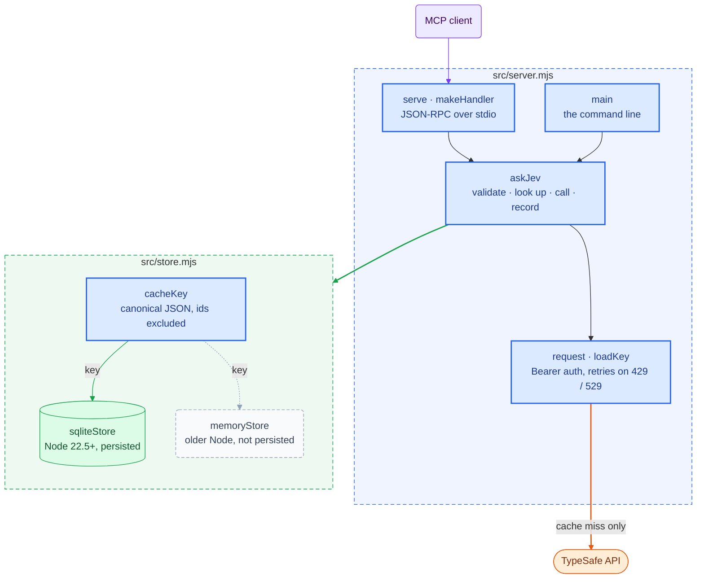
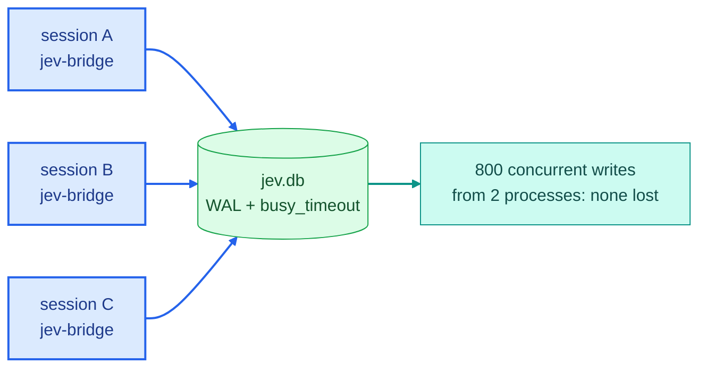
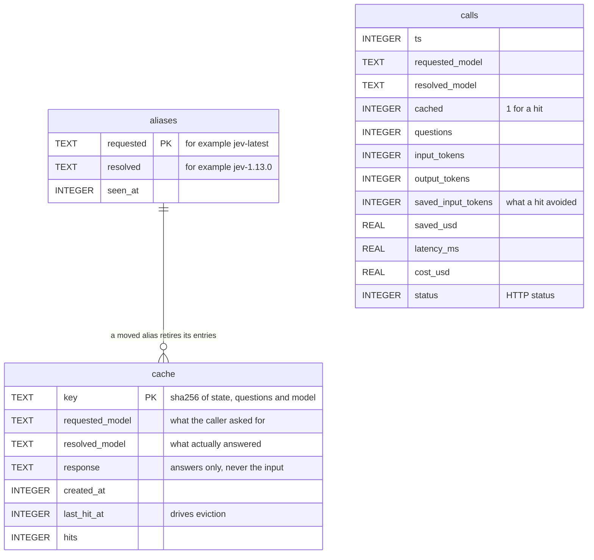

# Architecture

The request path — where each piece runs, and what happens during one call — is
drawn in the [README](../README.md#how-it-works). This page covers what sits
underneath it: the components, the storage, how cache keys work, and how the
whole thing is tested.

- [Components](#components)
- [Storage](#storage)
- [Cache keys](#cache-keys)
- [Is Jev deterministic?](#is-jev-deterministic)
- [Performance](#performance)
- [How it is tested](#how-it-is-tested)
- [Design decisions](#design-decisions)

## Components

Two modules, no dependencies. Colours and shapes follow the
[key in the README](../README.md#reading-the-diagrams); a **dashed grey** box is
not persisted, and **teal** marks a claim proven by a test.



| Module | Responsibility |
| --- | --- |
| `src/server.mjs` | The MCP protocol, the three tools, question validation, the HTTP client with retries, key loading, and the command line. |
| `src/store.mjs` | Cache keys, the SQLite store, and an in-memory store with the same interface for Node versions that lack `node:sqlite`. |

Two rules hold everywhere. **stdout carries protocol bytes and nothing else** —
a stray `console.log` corrupts the JSON-RPC stream, and the only symptom is a
client reporting the server as disconnected. And **only a 200 is ever cached**.

## Storage

Two things are saved: answers, so a repeat costs nothing, and usage, so spend is
a number you can look at.

### Why SQLite, and not a JSON file

The deciding constraint is not speed. It is that **every MCP client session
starts its own jev-bridge process**, and they all share one store. That rules
out most of the simple formats before performance is even discussed.

| Option | Find one answer | Two sessions writing at once | Evicting old entries |
| --- | --- | --- | --- |
| JSON file | load the whole file | **loses whichever write lands second** | rewrite everything |
| CSV | scan every row | appends survive, edits do not | rewrite everything |
| JSONL | load it all into memory | appends survive | needs compaction, which races |
| XML | parse the whole document | the same failure as JSON | rewrite everything |
| **SQLite** | indexed lookup | **built for it** (WAL) | one statement |

It costs no dependency: [`node:sqlite`](https://nodejs.org/api/sqlite.html) is
built into Node from 22.5 onward.

### Proven, not argued



The concurrency claim is a test, not an argument: two real processes each write
400 entries to one database file at the same moment, and all 800 survive.
Remove the `busy_timeout` line and that test fails — which is exactly what a
JSON file would do, quietly, with no line to remove.

### Schema



The cache stores **answers only**. Your `state` and your questions are never
written to disk: the key is a SHA-256 hash of them, which cannot be read back.
`cache` is a `WITHOUT ROWID` table indexed on `last_hit_at`, so a lookup is one
index probe and eviction is one statement.

### Where it lives

```text
~/.jev-bridge/          created 0700 on first use
├── .env                your API key, if you keep it in a file (0600)
└── jev.db              the three tables above
```

While the database is open, SQLite keeps `jev.db-wal` and `jev.db-shm` beside
it; a checkpoint folds them back in.

## Cache keys

### What makes two requests the same

- The **state**, the **model**, and the **meaning** of each question.
- **Question ids are excluded.** Answers are stored against the question that
  earned them and handed back under whatever ids the current caller used.
- **Object key order is ignored; array order is not.** The levels of a `score`
  are ordered, and reversing them is a different question whose answer must
  never be served for the original.
- **Entries expire after 7 days**, and the least recently used are evicted past
  20,000.

### The bug a real session found

The unit tests passed while the cache was effectively broken. Driving jev-bridge
from a real Claude Code session showed back-to-back identical questions missing
every time. The only difference between them:

```jsonc
// session A
{ "urgency":       { "type": "noul", "instructions": "Does this convey urgency?" } }
// session B
{ "urgency_check": { "type": "noul", "instructions": "Does this convey urgency?" } }
```

Same state, same question, same type — a different **id**, invented by the
model. TypeSafe's contract says ids are never sent to the model, so to Jev these
are one question. The first version keyed on them anyway, and because an agent
picks a fresh id on every run, the cache would have missed nearly every time it
mattered.

After the fix, against the live API:

```text
call 1   id = alpha           cached: false   {"alpha": {"noul": 0.97}}   166.02 ms
call 2   id = beta            cached: true    {"beta":  {"noul": 0.97}}     0.15 ms
call 3   reworded question    cached: false   a different question must miss
```

A caveat worth keeping in mind: agents also **rephrase**. Two independent
sessions asked the same thing in wording 46 tokens apart, and correctly missed.
Expect hits within a session and from code that sends a fixed question, not
across sessions where the model writes the question afresh.

### A moved alias invalidates itself

Each cache entry records the model that actually answered it, and the `aliases`
table records what each alias currently resolves to. When `jev-latest` starts
resolving to a newer version, entries answered by the older one stop being
served, instead of silently outliving the release.

## Is Jev deterministic?

Nearly. Three identical live calls:

| Run | `is_urgent` | billing | `frustration` | Latency |
| --- | --- | --- | --- | --- |
| 1 | 0.95 | 0.89 | 1.05 | 235 ms |
| 2 | 0.95 | 0.85 | 1.04 | 195 ms |
| 3 | 0.95 | 0.86 | 1.04 | 121 ms |

The **decisions** never move — billing every time, the same noul. The
probabilities wobble by about 0.02 in the second decimal. Caching is therefore
safe, and it makes repeated runs more reproducible than the API itself. The one
caution: a threshold tuned right at a boundary would be pinned to one sample of
that wobble. Pass `"cache": false` when you are measuring rather than deciding.

## Performance

| Measurement | Result |
| --- | --- |
| Live call | 184 ms, average of 3 |
| Cached call | **0.077 ms**, median of 20 |
| Speed-up on a repeat | about **2,370×** |
| Cost of a cache hit | **$0** |
| Cost of a typical 400-token call | about $0.000017 |
| A small database on disk | around 40 KB, mostly SQLite page overhead |

## How it is tested

35 tests on the built-in `node --test` runner — no test framework installed.

- **Only the TypeSafe API is faked**, because it is external and billed.
  SQLite, the MCP protocol over a real child process, and two processes
  contending for one file all run for real.
- **Every behaviour runs twice**: against the SQLite store and against the
  memory fallback.
- **CI runs Node 20, 22 and 24.** Node 20 has no `node:sqlite`, so there the
  SQLite suites skip and the fallback is what gets tested.
- **The suite never touches a real key or a real home directory**: every server
  it starts gets `TYPESAFE_API_KEY`, `TYPESAFE_DB` and `JEV_BRIDGE_HOME`.

A passing test proves nothing until it has been seen to fail. Each of these was
checked by breaking the code on purpose and confirming a test noticed:

| Mutation | Caught |
| --- | --- |
| The cache key stops ignoring object key order | ✅ |
| The cache key includes the caller's question ids | ✅ |
| Score levels get sorted, losing their order | ✅ |
| Answers come back without being remapped to the caller's ids | ✅ |
| The TTL never expires an entry | ✅ |
| Failed calls get cached | ✅ |
| A moved model alias goes undetected | ✅ |
| Eviction by age instead of by use | ✅ |
| `busy_timeout` removed | ✅ |
| Question validation skipped | ✅ |

Beyond the suite, jev-bridge was driven end to end from a real Claude Code
session — which is how the question-id bug was found, and something no unit test
had thought to ask.

## Design decisions

### Built

- **An answer cache**, keyed on meaning rather than ids, with TTL and LRU eviction.
- **A usage log**, surfaced through `jev_usage` and `--stats`.
- **Typed output** — `jev_ask` declares an `outputSchema` and returns `structuredContent`.
- **Alias-drift invalidation**, so a model release retires stale answers.
- **An in-memory fallback**, so an old Node degrades instead of failing to start.

### Declined, on purpose

- **The official SDKs.** They would bring maintained retries and types, but
  cost the zero-dependency property — which is what lets a bare
  `node src/server.mjs` start with nothing installed and nothing to rot.
- **A `jev_decide` tool** that bakes confidence thresholds into the bridge.
  TypeSafe's own guidance is to keep raw judgments reusable and policy in your
  code. A threshold baked in here would be a decision every caller inherits and
  none can see.

### Not yet

- **Normalising question text.** Case and whitespace differences still miss.
  Real rephrasing should miss; `"Does this convey urgency?"` and
  `"does this convey urgency? "` need not.
- **A shared rate-limit budget.** Each process retries on its own. That is
  invisible at modest volume and would not be at a thousand calls a minute.
- **Pruning the usage log.** The cache evicts itself; the log grows without a
  ceiling, at roughly 80 bytes a call.
