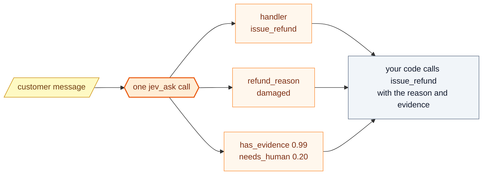
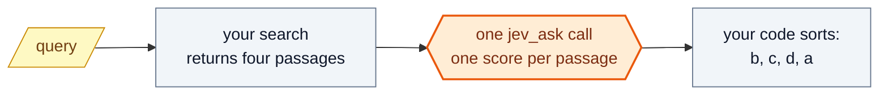
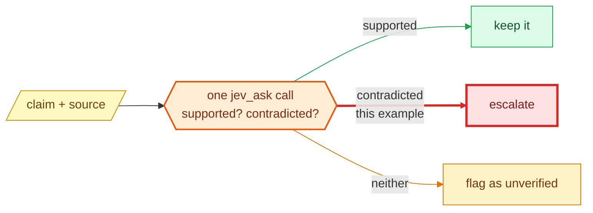
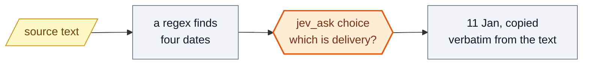
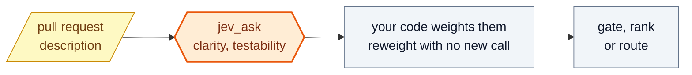

# Recipes

Six patterns for getting useful judgments out of Jev. Every output below is the
**real** response from `jev-1.13.0` — all six together ran in 1.3 seconds and
cost $0.000162.

Each recipe shows the essential request. You rarely write it by hand: ask
Claude Code for the pattern in plain language — *"use jev_ask to rerank these
passages against my query"* — and it builds the request for you.

A theme runs through all six: **code stays in control**. Code gathers the
candidates, decides the policy and takes the action; Jev supplies only the
judgment in between. The diagrams show it in colour: 🟨 **yellow** parallelograms
are your input, 🟧 **orange** hexagons are Jev's judgment with its answers in pale
orange, and ⬜ **grey** rectangles are your code. Where an outcome is shown, green,
amber and red mean keep, flag and escalate.

1. [Route a request and fill its arguments in one trip](#1-route-a-request-and-fill-its-arguments-in-one-trip)
2. [Rerank what your search returned](#2-rerank-what-your-search-returned)
3. [Check a claim against its evidence](#3-check-a-claim-against-its-evidence)
4. [Apply labels that can all be true at once](#4-apply-labels-that-can-all-be-true-at-once)
5. [Let code find candidates, and Jev pick the right one](#5-let-code-find-candidates-and-jev-pick-the-right-one)
6. [Score dimensions once, decide the policy in code](#6-score-dimensions-once-decide-the-policy-in-code)

---

## 1. Route a request and fill its arguments in one trip

Choose the handler **and** the arguments each branch would need, at once. The questions cannot see each other's answers, so state the branch as a premise — "IF this is a refund…" — and let your code read only the answers that apply to the branch it takes.



```json
{
  "state": "Can you refund my last order? The mug arrived cracked and I have photos.",
  "questions": {
    "handler": { "type": "choice", "instructions": "Which handler should take this request?",
      "criteria": { "issue_refund": "Customer wants money back", "track_order": "Asking where an order is",
                    "cancel_subscription": "Wants to stop recurring billing", "none": "No handler fits" } },
    "refund_reason": { "type": "choice", "instructions": "IF this is a refund, what is the stated reason?",
      "criteria": { "damaged": "Arrived broken or damaged", "not_received": "Never arrived",
                    "wrong_item": "Wrong product sent", "changed_mind": "No longer wants it" } },
    "has_evidence": { "type": "noul", "instructions": "Does the customer say they have evidence such as photos?" },
    "needs_human": { "type": "noul", "instructions": "Does this need a human agent rather than automation?",
      "criteria": { "true": "Ambiguous, disputed, or high value", "false": "A clear, routine, automatable case" } }
  }
}
```

```text
handler        choice  ████████████████████  issue_refund  confidence 1.00
refund_reason  choice  ████████████████████  damaged       confidence 1.00
has_evidence   noul    ███████████████████▊  0.99
needs_human    noul    ████                  0.20
```

Both choices came back at confidence **1.00**, every rival option at zero. A router and its arguments in one round trip: 527 input tokens, 233 ms, $0.000022. Had the handler been `track_order`, the `refund_reason` answer would simply be ignored.

---

## 2. Rerank what your search returned

Retrieval returns candidates; it does not know which one answers the question. Give each passage its own comparable `score` against the query, in a single call, and sort in code.



```json
{
  "state": {
    "query": "How do I rotate the API key without downtime?",
    "passages": {
      "a": "Billing plans are charged monthly and can be cancelled at any time from the dashboard.",
      "b": "To replace a credential, add the new key first, deploy, then revoke the old one. No restart needed.",
      "c": "API keys are created in Settings. Each key is shown once and cannot be retrieved later.",
      "d": "Our status page lists historical incidents and scheduled maintenance windows."
    }
  },
  "questions": {
    "a": { "type": "score", "instructions": "How well does `passages.a` answer `query`?",
           "criteria": ["Unrelated", "Same topic but does not answer it",
                        "Partly answers it", "Directly and completely answers it"] }
  }
}
```

```text
How well does each passage answer the query?   (score, 0–3)

b  ███████████████████▉  2.99  ← answers the query
c  ███████▏              1.06  ← on topic, but never answers it
d  ▋                     0.10
a  ▍                     0.06
```

The same `score` question is repeated for `b`, `c` and `d` in the same call. The instructive result is **c**: it is *about* API keys but never answers the question, and it lands exactly one level above the two unrelated passages. A keyword search would have ranked it first.

---

## 3. Check a claim against its evidence

The guard to put in front of anything a language model asserts. Ask about support and contradiction **separately**: "unsupported" and "contradicted" are different failures and deserve different handling.



```json
{
  "state": {
    "claim": "The free plan includes 10 GB of storage.",
    "source": "Free accounts may store up to 2 GB. Pro accounts include 100 GB and priority support."
  },
  "questions": {
    "supported": { "type": "noul", "instructions": "Is `claim` fully supported by `source`?",
      "criteria": { "true": "Every part of the claim is stated in the source",
                    "false": "Any part is missing or altered" } },
    "contradicted": { "type": "noul", "instructions": "Does `source` directly contradict `claim`?" }
  }
}
```

```text
supported     noul  ▎                     0.01
contradicted  noul  ███████████████████   0.95  ← the source says otherwise
```

A plausible-looking number, caught. It is not merely unsupported — 0.95 says the source states otherwise, which is the case to escalate rather than quietly drop. Two questions give three outcomes; one question would have given two.

---

## 4. Apply labels that can all be true at once

The most common modelling mistake is reaching for `choice` here. A choice forces a single winner and would have to discard three true facts. Use one `noul` per label.

```json
{
  "state": "Third time this week the export button does nothing. I am on the Pro plan paying $40/mo and I want a refund if this is not fixed today.",
  "questions": {
    "reports_bug":      { "type": "noul", "instructions": "Does the message report a product defect?" },
    "mentions_billing": { "type": "noul", "instructions": "Does the message mention billing, price or a plan?" },
    "requests_refund":  { "type": "noul", "instructions": "Is the customer asking for a refund?" },
    "churn_risk":       { "type": "noul", "instructions": "Does the message suggest the customer may leave?" }
  }
}
```

```text
reports_bug       noul  ███████████████████▍  0.97
mentions_billing  noul  ███████████████████▊  0.99
requests_refund   noul  ███████████████████▍  0.97
churn_risk        noul  █████████████████▋    0.88  ← inferred rather than stated
```

All four are true, in one sentence. `churn_risk` sits lower at 0.88 because it is inferred rather than stated — the honest answer, and a useful one to threshold on.

---

## 5. Let code find candidates, and Jev pick the right one

Do not ask a model to *extract* a date; ask it to *choose* one. A regular expression finds every date reliably, and only the choice needs judgment. The value you copy is then guaranteed to occur in the source.



```json
{
  "state": {
    "text": "Ordered 3 Jan, dispatched 5 Jan, and it should reach you by 11 Jan. Returns close 25 Jan.",
    "candidates": ["3 Jan", "5 Jan", "11 Jan", "25 Jan"]
  },
  "questions": {
    "delivery_date": { "type": "choice", "instructions": "Which candidate is the expected DELIVERY date?",
      "criteria": { "3 Jan": null, "5 Jan": null, "11 Jan": null, "25 Jan": null,
                    "none": "No candidate is the delivery date" } }
  }
}
```

```text
Which candidate is the expected DELIVERY date?   (choice)

11 Jan  ████████████████████  1.00  the delivery date
3 Jan   ·                     0.00  ordered
5 Jan   ·                     0.00  dispatched
25 Jan  ·                     0.00  returns close
none    ·                     0.00
```

Confidence 1.00, with the three decoy dates at zero. Include a `none` option, as this does: without one, a candidate list that misses the real answer forces a confident wrong pick.

---

## 6. Score dimensions once, decide the policy in code

Keep the judgment and the policy apart. Jev rates each dimension; your code weights them. Changing a weight or a threshold then costs nothing, because the evidence has not changed and nothing needs to be asked again.



```json
{
  "state": "Fixes the thing. See ticket.",
  "questions": {
    "clarity": { "type": "score", "instructions": "How clearly does this pull request description explain the change?",
      "criteria": ["Says nothing useful", "Names the area but not the change",
                   "Explains what changed", "Explains what changed and why"] },
    "testability": { "type": "score", "instructions": "How well does it explain how to verify the change?",
      "criteria": ["No way to verify", "Vague hint", "Concrete steps or tests named"] }
  }
}
```

```text
clarity      score 0–3  ▍                     0.05  confidence 0.95
testability  score 0–2  ██                    0.20  confidence 0.69  ← least certain answer here
```

```js
const quality = 0.6 * (clarity.score / 3) + 0.4 * (testability.score / 2); // 0.05
```

`testability` came back at confidence **0.69** — the least certain answer in these
recipes. There is genuinely little to judge in six words, and the model says so
rather than guessing firmly. Use confidence like this to route uncertain cases to a
person.
