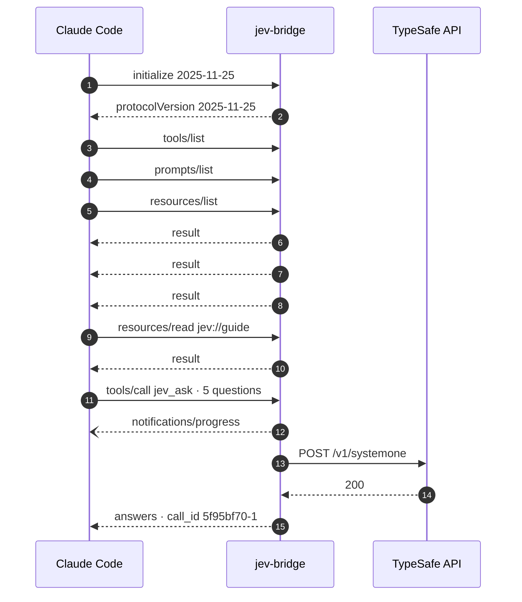
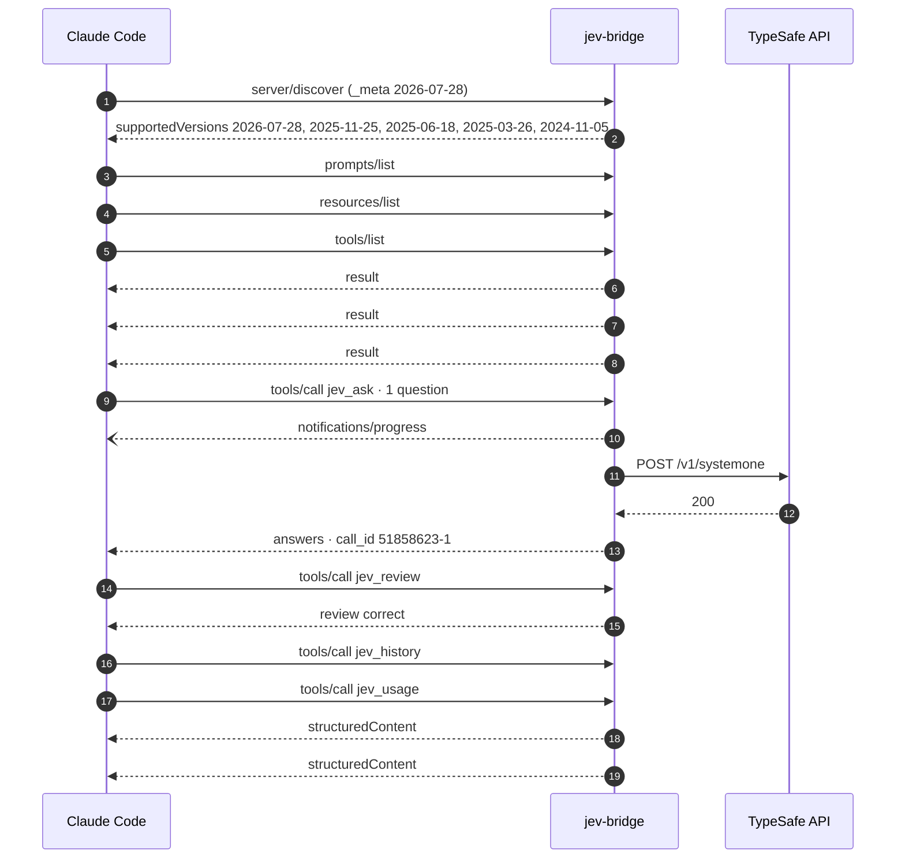

# Evidence: Claude Code calls jev-bridge

<!-- Generated by evidence/report.mjs from evidence/runs and evidence/validation.json. Do not edit by hand. -->

Recorded 2026-09-21 (UTC) with Claude Code 2.1.278, headless (`claude -p`), with only this server configured. Each session ran through [`tap.mjs`](tap.mjs), which sits between Claude Code and the server and logs every JSON-RPC message. The prompts ask for an outcome and never name a tool, so the agent had to choose the tools itself.

**24 of 24 checks passed across 7 sessions.** Every session identified itself as `claude-code`, and the server's own history filed the calls under `claude-code`.

| Session | Model | Protocol | What Claude Code sent | Tools the agent called | Checks |
| --- | --- | --- | --- | --- | --- |
| [Several labels at once, instructions only](#legacy-multilabel) | sonnet-5 | 2025-11-25 | `initialize` → `tools/list` → `prompts/list` → `resources/list` → `resources/read` → `tools/call` | `jev_ask` | ✅ 4/4 |
| [Reranking search results over 2026-07-28](#modern-rerank) | sonnet-5 | 2026-07-28 | `server/discover` → `prompts/list` → `resources/list` → `tools/list` → `resources/read` → `tools/call` | `jev_ask` | ✅ 3/3 |
| [Judge, record the truth, audit](#modern-review-workflow) | sonnet-5 | 2026-07-28 | `server/discover` → `prompts/list` → `resources/list` → `tools/list` → `tools/call` ×4 | `jev_ask`, `jev_review`, `jev_history`, `jev_usage` | ✅ 5/5 |
| [An MCP prompt as a slash command](#prompt-cost-report) | sonnet-5 | 2025-11-25 | `initialize` → `tools/list` → `prompts/list` → `resources/list` → `prompts/get` → `tools/call` ×2 | `jev_usage`, `jev_history` | ✅ 4/4 |
| [A resource read, then applied](#resource-guide) | sonnet-5 | 2025-11-25 | `initialize` → `tools/list` → `prompts/list` → `resources/list` → `resources/read` → `tools/call` | `jev_ask` | ✅ 3/3 |
| [The same, on Haiku, asked loosely](#resource-guide-haiku) | haiku-4-5 | 2025-11-25 | `initialize` → `tools/list` → `prompts/list` → `resources/list` → `resources/read` → `tools/call` | `jev_ask` | ✅ 2/2 |
| [Checking the key, on Haiku](#modern-models) | haiku-4-5 | 2026-07-28 | `server/discover` → `prompts/list` → `resources/list` → `tools/list` → `tools/call` | `jev_models` | ✅ 3/3 |

## Checked against the official MCP schema

[`validate-wire.mjs`](validate-wire.mjs) validated every message with ajv 8.20.0 (Ajv2020) against the official JSON Schema of the revision it used, fetched from the MCP repository ([2025-11-25](https://raw.githubusercontent.com/modelcontextprotocol/modelcontextprotocol/main/schema/2025-11-25/schema.json) sha256 `268a5f82ba70…`, [2026-07-28](https://raw.githubusercontent.com/modelcontextprotocol/modelcontextprotocol/main/schema/2026-07-28/schema.json) sha256 `ef70b61f99b6…`). Full output: [`validation.json`](validation.json).

| What | Valid |
| --- | --- |
| Server messages in the recorded sessions | 49 / 49 |
| Claude Code's messages in the recorded sessions | 48 / 48 |
| Server messages in a sweep of every method, both revisions, error paths included | 53 / 53 |
| Tool `inputSchema` and `outputSchema` against the JSON Schema 2020-12 meta-schema | 10 / 10 |

The sweep also sent 5 deliberately malformed requests (`no/such/method`, `tools/list`, `tools/list`, `ping`, `server/discover`); each got the error code the spec names for it, and those error responses are counted above.

## The two protocol revisions, as recorded

**2025-11-25**, Claude Code's default for a stdio server: `initialize` first, then plain requests (several labels at once, instructions only).



**2026-07-28**, with `MCP_SDK_GENERATION=v2 MCP_PROTOCOL_NEGOTIATION=auto`: Claude Code probes with `server/discover`, gets a list of supported versions, and from then on sends every request with `_meta` and no handshake at all.



The probe and the first tool call, verbatim from the log:

```json
{"jsonrpc":"2.0","id":"server-discover-probe-1","method":"server/discover","params":{"_meta":{"io.modelcontextprotocol/protocolVersion":"2026-07-28","io.modelcontextprotocol/clientInfo":{"name":"claude-code","title":"Claude Code","version":"2.1.278","description":"Anthropic's agentic coding tool","websiteUrl":"https://claude.com/claude-code"},"io.modelcontextprotocol/clientCapabilities":{"roots":{"listChanged":true},"elicitation":{}}}}}
{"method":"tools/call","params":{"name":"jev_ask","arguments":"…","_meta":{"io.modelcontextprotocol/protocolVersion":"2026-07-28","io.modelcontextprotocol/clientInfo":{"name":"claude-code","title":"Claude Code","version":"2.1.278","description":"Anthropic's agentic coding tool","websiteUrl":"https://claude.com/claude-code"},"io.modelcontextprotocol/clientCapabilities":{"roots":{"listChanged":true},"elicitation":{}},"claudecode/toolUseId":"toolu_01AXM5TBuDpjTPY9anKi9DcM","progressToken":3}},"jsonrpc":"2.0","id":3}
```

## How reliably

One recording shows that something happened, not how often it does. These scenarios were recorded again, several times each, with the same prompt and code, and each run graded by the same checks ([`runs/<scenario>/trials/`](runs)). Trial 0 of `resource-guide-haiku` is an earlier recording of the same prompt whose wire log was kept but whose transcript was not.

| Scenario | Model | Check | Runs that passed |
| --- | --- | --- | --- |
| [legacy-multilabel](#legacy-multilabel) | sonnet-5 | Claude Code opened with initialize (2025-11-25) | 3 / 3 |
|  |  | one jev_ask call holding all 5 judgments (batched) | 3 / 3 |
|  |  | the labels were asked as separate nouls, since several can be true | 3 / 3 |
|  |  | no tool call ended in isError, and no JSON-RPC error | 3 / 3 |
| [modern-rerank](#modern-rerank) | sonnet-5 | server/discover answered; no initialize; every request carried _meta protocolVersion 2026-07-28 | 3 / 3 |
|  |  | one jev_ask call scoring every passage (batched) | 3 / 3 |
|  |  | no tool call ended in isError, and no JSON-RPC error | 3 / 3 |
| [resource-guide-haiku](#resource-guide-haiku) | haiku-4-5 | resources/read jev://guide | 6 / 6 |
|  |  | jev_ask was called to make the judgment | 5 / 6 |

## Sessions

### legacy-multilabel

**Several labels at once, instructions only.** Default Claude Code (2025-11-25 handshake) with every skill disabled, so only the server's instructions, descriptions and guide steer the agent. Four labels that can all be true, plus urgency.

Model `claude-sonnet-5` · protocol 2025-11-25 · 4 turns · Claude $0.080 · [wire](runs/legacy-multilabel/wire.jsonl) · [transcript](runs/legacy-multilabel/transcript.jsonl) · [command](runs/legacy-multilabel/meta.json)

> A customer wrote: "Third time this week the export button does nothing. I'm on the Pro plan paying $40/mo and I want a refund if this isn't fixed today." Which of these apply: bug report, billing question, refund request, churn risk? And how urgent is it? I want calibrated probabilities, not your impression.

- ✅ Claude Code opened with initialize (2025-11-25)
- ✅ one jev_ask call holding all 5 judgments (batched)
- ✅ the labels were asked as separate nouls, since several can be true
- ✅ no tool call ended in isError, and no JSON-RPC error

Agent steps: `ToolSearch` → `ReadMcpResourceTool` → `mcp__jev__jev_ask`

<details><summary><code>jev_ask</code> as the agent wrote it, and what came back</summary>

```json
{
  "state": {
    "customer_message": "Third time this week the export button does nothing. I'm on the Pro plan paying $40/mo and I want a refund if this isn't fixed today."
  },
  "questions": {
    "bug_report": {
      "type": "noul",
      "instructions": "Does `customer_message` report a malfunction of the product, i.e. a feature that is not working as expected?",
      "criteria": {
        "true": "The customer describes a feature failing or behaving incorrectly.",
        "false": "No product malfunction is described."
      }
    },
    "billing_question": {
      "type": "noul",
      "instructions": "Does `customer_message` ask a question about charges, invoices, pricing, payment methods or how the customer is billed, as distinct from demanding money back?",
      "criteria": {
        "true": "The customer asks about, or seeks clarification of, their billing, charges, invoices or pricing.",
        "false": "The customer does not ask anything about billing, charges, invoices or pricing."
      }
    },
    "refund_request": {
      "type": "noul",
      "instructions": "Does `customer_message` request a refund, even conditionally?",
      "criteria": {
        "true": "The customer asks for money back, including on a condition such as the problem not being fixed.",
        "false": "The customer does not ask for money back."
      }
    },
    "churn_risk": {
      "type": "noul",
      "instructions": "Does `customer_message` indicate a meaningful risk that this customer will cancel or stop paying for the product?",
      "criteria": {
        "true": "The customer signals dissatisfaction that could plausibly lead to cancellation or non-renewal.",
        "false": "The customer shows no sign of leaving."
      }
    },
    "urgency": {
      "type": "score",
      "instructions": "How urgently does `customer_message` need a response from support?",
      "criteria": [
        "No time pressure; can wait a week or more",
        "Would like an answer soon, but no deadline",
        "Needs attention within a few days",
        "Needs attention within one business day",
        "Customer states a same-day deadline or has an active outage causing loss of money or data"
      ]
    }
  }
}
```

```json
{
  "model": "jev-1.13.0",
  "answers": {
    "bug_report": {
      "type": "noul",
      "noul": 0.99
    },
    "billing_question": {
      "type": "noul",
      "noul": 0.05
    },
    "refund_request": {
      "type": "noul",
      "noul": 0.99
    },
    "churn_risk": {
      "type": "noul",
      "noul": 0.93
    },
    "urgency": {
      "type": "score",
      "score": 4,
      "confidence": 1,
      "legend": {
        "0": "No time pressure; can wait a week or more",
        "1": "Would like an answer soon, but no deadline",
        "2": "Needs attention within a few days",
        "3": "Needs attention within one business day",
        "4": "Customer states a same-day deadline or has an active outage causing loss of money or data"
      },
      "probabilities": {
        "0": 0,
        "1": 0,
        "2": 0,
        "3": 0,
        "4": 1
      }
    }
  },
  "bridge": {
    "cached": false,
    "latency_ms": 241.72,
    "cost_usd": 0.000028770000000000004,
    "attempts": 1,
    "request_id": "req_01a0c26e8d1d7e6693a7d378edf6ecf1",
    "call_id": "5f95bf70-1"
  }
}
```

</details>

What the agent told the user:

> Jev's answers, from one call (`5f95bf70-1`, `jev-1.13.0`):
> 
> | Label | P(applies) |
> |---|---|
> | Bug report | 0.99 |
> | Refund request | 0.99 |
> | Churn risk | 0.93 |
> | Billing question | 0.05 |
> 
> **Urgency:** Jev put essentially all its probability (rounded to 1.0, confidence 1) on the top level of my 5-level rubric: "customer states a same-day deadline or has an active problem causing loss." Levels 0 to 3 all came back at 0. The customer said "today," so the top level follows from the text.
> 
> - **Multi-label:** Bug report, refund request and churn risk can all be true at once, so I asked each as a separate yes/no. Three of the four clear a 0.9 bar.
> - **Billing question:** I defined it as asking about charges or invoices, separate from demanding money back. The customer only mentions the price as context for the refund, so 0.05 is expected. If your routing treats any refund message as billin…

### modern-rerank

**Reranking search results over 2026-07-28.** Claude Code negotiating MCP 2026-07-28: server/discover, per-request _meta, no initialize. Rerank four passages against a query.

Model `claude-sonnet-5` · protocol 2026-07-28 · 4 turns · Claude $0.131 · [wire](runs/modern-rerank/wire.jsonl) · [transcript](runs/modern-rerank/transcript.jsonl) · [command](runs/modern-rerank/meta.json)

> My search for "how do I rotate the API key without downtime?" returned these passages. Rank them by how well they actually answer the question, with a calibrated score for each.
> a) "API keys are created in the console under Settings > Keys."
> b) "To rotate without downtime, create a second key, deploy it everywhere, then revoke the old one; both keys work during the overlap."
> c) "Keys should be rotated every 90 days as a security best practice."
> d) "Our uptime SLA is 99.95% for paid plans."

- ✅ server/discover answered; no initialize; every request carried _meta protocolVersion 2026-07-28
- ✅ one jev_ask call scoring every passage (batched)
- ✅ no tool call ended in isError, and no JSON-RPC error

Agent steps: `ToolSearch` → `ReadMcpResourceTool` → `mcp__jev__jev_ask`

<details><summary><code>jev_ask</code> as the agent wrote it, and what came back</summary>

```json
{
  "state": {
    "query": "how do I rotate the API key without downtime?",
    "passages": {
      "a": "API keys are created in the console under Settings > Keys.",
      "b": "To rotate without downtime, create a second key, deploy it everywhere, then revoke the old one; both keys work during the overlap.",
      "c": "Keys should be rotated every 90 days as a security best practice.",
      "d": "Our uptime SLA is 99.95% for paid plans."
    }
  },
  "questions": {
    "a": {
      "type": "score",
      "instructions": "How well does `passages.a` answer the search query `query`? Judge only whether the passage itself tells the searcher how to do what they asked.",
      "criteria": [
        "Unrelated to the query's topic",
        "Same general topic (API keys, uptime, or security) but does not help the searcher do what they asked",
        "Provides a piece of background or a prerequisite step, but not the method the query asks for",
        "Gives a partial method for the query, missing important steps or the no-downtime aspect",
        "Directly and completely answers the query with a concrete procedure that addresses the no-downtime requirement"
      ]
    },
    "b": {
      "type": "score",
      "instructions": "How well does `passages.b` answer the search query `query`? Judge only whether the passage itself tells the searcher how to do what they asked.",
      "criteria": [
        "Unrelated to the query's topic",
        "Same general topic (API keys, uptime, or security) but does not help the searcher do what they asked",
        "Provides a piece of background or a prerequisite step, but not the method the query asks for",
        "Gives a partial method for the query, missing important steps or the no-downtime aspect",
        "Directly and completely answers the query with a concrete procedure that addresses the no-downtime requirement"
      ]
    },
    "c": {
      "type": "score",
      "instructions": "How well does `passages.c` answer the search query `query`? Judge only whether the passage itself tells the searcher how to do what they asked.",
      "criteria": [
        "Unrelated to the query's topic",
        "Same general topic (API keys, uptime, or security) but does not help the searcher do what they asked",
        "Provides a piece of background or a prerequisite step, but not the method the query asks for",
        "Gives a partial method for the query, missing important steps or the no-downtime aspect",
        "Directly and completely answers the query with a concrete procedure that addresses the no-downtime requirement"
      ]
    },
    "d": {
      "type": "score",
      "instructions": "How well does `passages.d` answer the search query `query`? Judge only whether the passage itself tells the searcher how to do what they asked.",
      "criteria": [
        "Unrelated to the query's topic",
        "Same general topic (API keys, uptime, or security) but does not help the searcher do what they asked",
        "Provides a piece of background or a prerequisite step, but not the method the query asks for",
        "Gives a partial method for the query, missing important steps or the no-downtime aspect",
        "Directly and completely answers the query with a concrete procedure that addresses the no-downtime requirement"
      ]
    }
  }
}
```

```json
{
  "model": "jev-1.13.0",
  "answers": {
    "a": {
      "type": "score",
      "score": 1.57,
      "confidence": 0.64,
      "legend": {
        "0": "Unrelated to the query's topic",
        "1": "Same general topic (API keys, uptime, or security) but does not help the searcher do what they asked",
        "2": "Provides a piece of background or a prerequisite step, but not the method the query asks for",
        "3": "Gives a partial method for the query, missing important steps or the no-downtime aspect",
        "4": "Directly and completely answers the query with a concrete procedure that addresses the no-downtime requirement"
      },
      "probabilities": {
        "0": 0,
        "1": 0.43,
        "2": 0.57,
        "3": 0,
        "4": 0
      }
    },
    "b": {
      "type": "score",
      "score": 4,
      "confidence": 1,
      "legend": {
        "0": "Unrelated to the query's topic",
        "1": "Same general topic (API keys, uptime, or security) but does not help the searcher do what they asked",
        "2": "Provides a piece of background or a prerequisite step, but not the method the query asks for",
        "3": "Gives a partial method for the query, missing important steps or the no-downtime aspect",
        "4": "Directly and completely answers the query with a concrete procedure that addresses the no-downtime requirement"
      },
      "probabilities": {
        "0": 0,
        "1": 0,
        "2": 0,
        "3": 0,
        "4": 1
      }
    },
    "c": {
      "type": "score",
      "score": 1.1,
      "confidence": 0.92,
      "legend": {
        "0": "Unrelated to the query's topic",
        "1": "Same general topic (API keys, uptime, or security) but does not help the searcher do what they asked",
        "2": "Provides a piece of background or a prerequisite step, but not the method the query asks for",
        "3": "Gives a partial method for the query, missing important steps or the no-downtime aspect",
        "4": "Directly and completely answers the query with a concrete procedure that addresses the no-downtime requirement"
      },
      "probabilities": {
        "0": 0,
        "1": 0.91,
        "2": 0.09,
        "3": 0,
        "4": 0
      }
    },
    "d": {
      "type": "score",
      "score": 0.88,
      "confidence": 0.89,
      "legend": {
        "0": "Unrelated to the query's topic",
        "1": "Same general topic (API keys, uptime, or security) but does not help the searcher do what they asked",
        "2": "Provides a piece of background or a prerequisite step, but not the method the query asks for",
        "3": "Gives a partial method for the query, missing important steps or the no-downtime aspect",
        "4": "Directly and completely answers the query with a concrete procedure that addresses the no-downtime requirement"
      },
      "probabilities": {
        "0": 0.13,
        "1": 0.87,
        "2": 0,
        "3": 0,
        "4": 0
      }
    }
  },
  "bridge": {
    "cached": false,
    "latency_ms": 185.39,
    "cost_usd": 0.000043302,
    "attempts": 1,
    "request_id": "req_01a0c26efca378059723dc821f171b56",
    "call_id": "19662bad-1"
  }
}
```

</details>

What the agent told the user:

> Jev's ranking (call `19662bad-1`, `jev-1.13.0`) puts **b** far ahead of the rest.
> 
> | Rank | Passage | Score (0–4) | Normalized | Jev confidence |
> |---|---|---|---|---|
> | 1 | **b** "To rotate without downtime, create a second key…" | 4.00 | 1.00 | 1.00 |
> | 2 | **a** "API keys are created in the console under Settings > Keys." | 1.57 | 0.39 | 0.64 |
> | 3 | **c** "Keys should be rotated every 90 days…" | 1.10 | 0.28 | 0.92 |
> | 4 | **d** "Our uptime SLA is 99.95%…" | 0.88 | 0.22 | 0.89 |
> 
> The scores sit on a rubric where 4 means a direct, complete answer with a concrete no-downtime procedure and 0 means unrelated. They are levels, not probabilities. I divided by 4 for the normalized column.
> 
> - **b** is the answer. It gives the whole procedure: create a second key, deploy it, revoke the old one, with both keys valid during the overlap. Jev put all its probability on the top level.
> - **a, c an…

### modern-review-workflow

**Judge, record the truth, audit.** MCP 2026-07-28, four tools in sequence: route a ticket, record the known truth against that exact call, then report cost and uncertain calls.

Model `claude-sonnet-5` · protocol 2026-07-28 · 7 turns · Claude $0.114 · [wire](runs/modern-review-workflow/wire.jsonl) · [transcript](runs/modern-review-workflow/transcript.jsonl) · [command](runs/modern-review-workflow/meta.json)

> Route this support ticket to billing, technical or sales: "The API returns a 500 error every time I upload an invoice PDF." Then, whatever it picked: I already know the right team is technical, so record that as the truth for this exact call in the review log. Finally tell me what these judgments have cost so far and list any past calls it was unsure about.

- ✅ server/discover answered; no initialize; every request carried _meta protocolVersion 2026-07-28
- ✅ jev_ask routed the ticket with a choice
- ✅ jev_review named the call_id jev_ask returned, with expected = technical
- ✅ jev_usage and jev_history were both used for the audit
- ✅ no tool call ended in isError, and no JSON-RPC error

Agent steps: `ToolSearch` → `ToolSearch` → `mcp__jev__jev_ask` → `mcp__jev__jev_review` → `mcp__jev__jev_usage` → `mcp__jev__jev_history`

<details><summary><code>jev_ask</code> as the agent wrote it, and what came back</summary>

```json
{
  "state": {
    "ticket": "The API returns a 500 error every time I upload an invoice PDF."
  },
  "questions": {
    "department": {
      "type": "choice",
      "instructions": "Which team should handle the support ticket in `ticket`?",
      "criteria": {
        "billing": "Payments, invoices as charges, refunds, subscriptions, pricing or account charges",
        "technical": "Bugs, errors, API failures, integrations, outages or how the product behaves",
        "sales": "Purchasing, quotes, plans, upgrades, demos or pre-sale questions"
      }
    }
  }
}
```

```json
{
  "model": "jev-1.13.0",
  "answers": {
    "department": {
      "type": "choice",
      "choice": "technical",
      "confidence": 1,
      "probabilities": {
        "technical": 1,
        "billing": 0,
        "sales": 0
      }
    }
  },
  "bridge": {
    "cached": false,
    "latency_ms": 240.84,
    "cost_usd": 0.000016464000000000004,
    "attempts": 1,
    "request_id": "req_01a0c26f5472785fb88a3a678066f1e2",
    "call_id": "51858623-1"
  }
}
```

</details>

- `jev_review` {"id":"51858623-1","verdict":"correct","expected":{"department":"technical"},"note":"User confirmed the right team is technical (API 500 error on invoice PDF upload is a product bug, not a billing matter)."} → {"id":"51858623-1","verdict":"correct","note":"User confirmed the right team is technical (API 500 error on invoice PDF upload is a product bug, not a billing matter).","expected":{"department":"technical"},"reviewed_at…
- `jev_history` {"filter":"uncertain"} → {"window_days":7,"filter":"uncertain","history":"full","stats":{"calls":3,"live_calls":3,"cache_hits":0,"errors":0,"performance":{"live_latency_ms":{"p50":240.84,"p95":241.72,"max":241.72},"cached_latency_ms":{"p50":nul…
- `jev_usage` {} → {"window_days":7,"calls":3,"live_calls":3,"cache_hits":0,"hit_rate":0,"errors":0,"input_tokens":2108,"output_tokens":182,"cost_usd":0.00008853600000000001,"saved_input_tokens":0,"saved_usd":0,"avg_live_latency_ms":223,"…

What the agent told the user:

> **Routing:** Jev routed the ticket to **technical** with confidence 1.0 (technical 1.0, billing 0, sales 0). The call took about 241 ms and cost $0.000016.
> 
> **Review log:** I recorded call `51858623-1` as **correct** with expected `{"department": "technical"}`. The note says you confirmed the team. Jev's pick already matched, so nothing needed correcting.
> 
> **Cost over the last 7 days:**
> - **Calls:** 3, all live. There were no cache hits, no errors and no retries.
> - **Tokens:** 2,108 input and 182 output.
> - **Spend:** about $0.0000885. Every call ran on `jev-1.13.0`, and average live latency was about 223 ms.
> - **Cache:** it has saved nothing so far because no request has repeated.
> - **Accuracy:** 100% on reviewed calls, but only one call has been reviewed, so that isn't much evidence.
> 
> **Uncertain calls:** none. No call in the window fell below the 0.6 certainty cut-off, and the filtere…

### prompt-cost-report

**An MCP prompt as a slash command.** /mcp__jev__cost_report 1 — Claude Code fetches the prompt with prompts/get, and the rendered prompt drives the usage and history tools.

Model `claude-sonnet-5` · protocol 2025-11-25 · 5 turns · Claude $0.113 · [wire](runs/prompt-cost-report/wire.jsonl) · [transcript](runs/prompt-cost-report/transcript.jsonl) · [command](runs/prompt-cost-report/meta.json)

> /mcp__jev__cost_report 1

- ✅ Claude Code opened with initialize (2025-11-25)
- ✅ prompts/get cost_report with days = "1"
- ✅ the prompt's steps ran: jev_usage and jev_history with days 1
- ✅ no tool call ended in isError, and no JSON-RPC error

Agent steps: `ToolSearch` → `ToolSearch` → `mcp__jev__jev_usage` → `mcp__jev__jev_history`

- `jev_usage` {"days":1} → {"window_days":1,"calls":3,"live_calls":3,"cache_hits":0,"hit_rate":0,"errors":0,"input_tokens":2108,"output_tokens":182,"cost_usd":0.00008853600000000001,"saved_input_tokens":0,"saved_usd":0,"avg_live_latency_ms":223,"…
- `jev_history` {"days":1,"limit":1} → {"window_days":1,"filter":"all","history":"full","stats":{"calls":3,"live_calls":3,"cache_hits":0,"errors":0,"performance":{"live_latency_ms":{"p50":240.84,"p95":241.72,"max":241.72},"cached_latency_ms":{"p50":null,"p95…

What the agent told the user:

> **Jev cost, last 1 day**
> 
> | | |
> |---|---|
> | Calls | 3 (all live) |
> | Cache hit rate | 0% (0 hits) |
> | Spent | $0.0000885 (2,108 input tokens, 182 output tokens) |
> | Saved by cache | $0.00 |
> | Live latency | p50 241 ms, p95 242 ms (average 223 ms) |
> | Errors / retries | 0 / 0 |
> | Model | `jev-1.13.0` |
> 
> **Quality:** 1 of 3 calls has been reviewed, and it was correct. None fell below the 0.6 certainty cut-off.
> 
> **Savings:** There is nothing to batch.
> - `resent_state_calls` is 0, so no live call re-sent a state that an earlier call could have covered.
> - `questions_per_live_call` is 3.33, so questions are already going out together.
> 
> **Cache:** The 0% hit rate is expected at this volume. Three different requests give the cache nothing to repeat, and it holds 3 entries with a 7-day TTL. It will only pay off if the same state and questions come back. Total spend is under a hundredth of a cent…

### resource-guide

**A resource read, then applied.** The jev://guide resource read (resources/read), then its "select, don't generate" rule applied through jev_ask.

Model `claude-sonnet-5` · protocol 2025-11-25 · 4 turns · Claude $0.115 · [wire](runs/resource-guide/wire.jsonl) · [transcript](runs/resource-guide/transcript.jsonl) · [command](runs/resource-guide/meta.json)

> Read @jev:jev://guide, then have Jev find the delivery date in: "Ordered 3 Jan, dispatched 5 Jan, and it should reach you by 11 Jan. Returns close 25 Jan." Tell me which rule from the guide you followed.

- ✅ resources/read jev://guide
- ✅ jev_ask with a choice over the candidate dates
- ✅ no tool call ended in isError, and no JSON-RPC error

Agent steps: `ToolSearch` → `ReadMcpResourceTool` → `mcp__jev__jev_ask`

<details><summary><code>jev_ask</code> as the agent wrote it, and what came back</summary>

```json
{
  "state": "Ordered 3 Jan, dispatched 5 Jan, and it should reach you by 11 Jan. Returns close 25 Jan.",
  "questions": {
    "delivery_date": {
      "type": "choice",
      "instructions": "Which of the dates listed in the options is the date the order is expected to be delivered, i.e. when it should reach the customer? Choose \"none\" if the text states no delivery date.",
      "criteria": {
        "3 Jan": "The date the order was placed",
        "5 Jan": "The date the order was dispatched (shipped)",
        "11 Jan": "The date the order should reach the customer",
        "25 Jan": "The date the returns window closes",
        "none": "The text states no delivery date"
      }
    }
  }
}
```

```json
{
  "model": "jev-1.13.0",
  "answers": {
    "delivery_date": {
      "type": "choice",
      "choice": "11 Jan",
      "confidence": 1,
      "probabilities": {
        "25 Jan": 0,
        "11 Jan": 1,
        "5 Jan": 0,
        "3 Jan": 0,
        "none": 0
      }
    }
  },
  "bridge": {
    "cached": false,
    "latency_ms": 175.03,
    "cost_usd": 0.000018564,
    "attempts": 1,
    "request_id": "req_01a0c26fe0167973ab371534eff1e797",
    "call_id": "12bebf13-1"
  }
}
```

</details>

What the agent told the user:

> The delivery date is **11 Jan**. Jev picked it with probability 1.0 and confidence 1.0, and gave 0 to every other option, including "none". The call ID is `12bebf13-1`.
> 
> **Rule I followed:** "Select, don't generate," from the guide's section on writing questions Jev reads literally. It says to find every candidate value in the text first. Then you ask Jev a choice over them, with a "none" option, and copy the chosen value verbatim.
> 
> - **Candidates:** I listed the four dates in the sentence exactly as written: `3 Jan`, `5 Jan`, `11 Jan` and `25 Jan`. I gave each a short description (ordered, dispatched, should reach the customer, returns close), and added `none` in case no delivery date was stated.
> - **Single question:** I sent one `choice` question, so nothing else needed batching.
> - **Verbatim copy:** I returned `11 Jan` as Jev returned it. I did not work out or reformat a date myself,…

### resource-guide-haiku

**The same, on Haiku, asked loosely.** Claude Haiku 4.5 with a looser prompt that never asks for Jev by name: does a small model still route the judgment through jev_ask?

Model `claude-haiku-4-5-20251001` · protocol 2025-11-25 · 5 turns · Claude $0.049 · [wire](runs/resource-guide-haiku/wire.jsonl) · [transcript](runs/resource-guide-haiku/transcript.jsonl) · [command](runs/resource-guide-haiku/meta.json)

> Read @jev:jev://guide, then use it to find the delivery date in: "Ordered 3 Jan, dispatched 5 Jan, and it should reach you by 11 Jan. Returns close 25 Jan." Tell me which rule from the guide you followed.

- ✅ resources/read jev://guide
- ✅ jev_ask was called to make the judgment

Agent steps: `ToolSearch` → `ReadMcpResourceTool` → `ToolSearch` → `mcp__jev__jev_ask`

<details><summary><code>jev_ask</code> as the agent wrote it, and what came back</summary>

```json
{
  "state": "Ordered 3 Jan, dispatched 5 Jan, and it should reach you by 11 Jan. Returns close 25 Jan.",
  "questions": {
    "delivery_date": {
      "type": "choice",
      "instructions": "Which date is the delivery date (when the item should reach the customer)?",
      "criteria": {
        "3 Jan": "Order date",
        "5 Jan": "Dispatch date",
        "11 Jan": "Target delivery date",
        "25 Jan": "Returns close date",
        "none": "Delivery date is not stated"
      }
    }
  }
}
```

```json
{
  "model": "jev-1.13.0",
  "answers": {
    "delivery_date": {
      "type": "choice",
      "choice": "11 Jan",
      "confidence": 1,
      "probabilities": {
        "5 Jan": 0,
        "11 Jan": 1,
        "3 Jan": 0,
        "none": 0,
        "25 Jan": 0
      }
    }
  },
  "bridge": {
    "cached": false,
    "latency_ms": 294.57,
    "cost_usd": 0.00001659,
    "attempts": 1,
    "request_id": "req_01a0c2703b4377708fa23f9a47e9eeb5",
    "call_id": "544f99b4-1"
  }
}
```

</details>

What the agent told the user:

> The delivery date is **11 Jan**.
> 
> **Rule I followed:** *"Select, don't generate. Find the candidate values first (every date or amount in the text), then ask Jev a choice over them, with a 'none' option, and copy the chosen value verbatim."*
> 
> I extracted all four dates from the text (3 Jan, 5 Jan, 11 Jan, 25 Jan) as candidates, then asked Jev to choose which was the delivery date from that set. Jev returned "11 Jan" with perfect confidence (1.0), which I copied verbatim. The guide explicitly warns against having Jev parse or extract dates—instead, I did the extraction in code and let Jev select the right one from my list.

### modern-models

**Checking the key, on Haiku.** MCP 2026-07-28 on Claude Haiku 4.5: the models endpoint as a tool, to check the key and list model names.

Model `claude-haiku-4-5-20251001` · protocol 2026-07-28 · 3 turns · Claude $0.030 · [wire](runs/modern-models/wire.jsonl) · [transcript](runs/modern-models/transcript.jsonl) · [command](runs/modern-models/meta.json)

> Is my TypeSafe API key working, and which Jev model names can I use?

- ✅ server/discover answered; no initialize; every request carried _meta protocolVersion 2026-07-28
- ✅ jev_models answered with the model list
- ✅ no tool call ended in isError, and no JSON-RPC error

Agent steps: `ToolSearch` → `mcp__jev__jev_models`

- `jev_models` {} → {"models":[{"name":"jev-latest","description":"The latest iteration of TypeSafe's System One Model: Jev","release_date":"2026-09-10T18:38:01.391457+00:00"},{"name":"jev-preview","description":"A preview version of `jev-…

What the agent told the user:

> Your TypeSafe API key is **working** ✓
> 
> **Available Jev models:**
> 
> | Model | Description | Released |
> |-------|-------------|----------|
> | `jev-latest` | The latest iteration of TypeSafe's System One Model: Jev | 2026-09-10 |
> | `jev-preview` | A preview version of `jev-latest`: should be better in most ways | 2026-09-10 |
> 
> You can use either `jev-latest` or `jev-preview` in the `model` field when calling `jev_ask`. Versioned IDs like `jev-1.13.0` are also accepted even if not listed.

## Reproduce

```bash
node evidence/run.mjs                    # record every session: needs claude and a TypeSafe key; costs about $0.60
node evidence/validate-wire.mjs         # installs Ajv into the temp directory, outside the project
node evidence/report.mjs                 # rewrite this page
```

Logs are sanitised as they are written ([`run.mjs`](run.mjs), `sanitize()`): the home directory becomes `~`, thinking signatures are dropped, and the init record keeps only this server's tools and commands. Records about the recording account (`rate_limit_event`) are left out, and the output of hooks from the recording machine's own Claude Code setup is replaced by a note saying so; the `hook_started` and `hook_response` records stay, so it is visible that a hook ran. In these recordings those were two `SessionStart` hooks from installed plugins: one injected a general guide to using skills, the other a CLI update notice. Neither mentions Jev, TypeSafe or MCP. Nothing else is changed.
